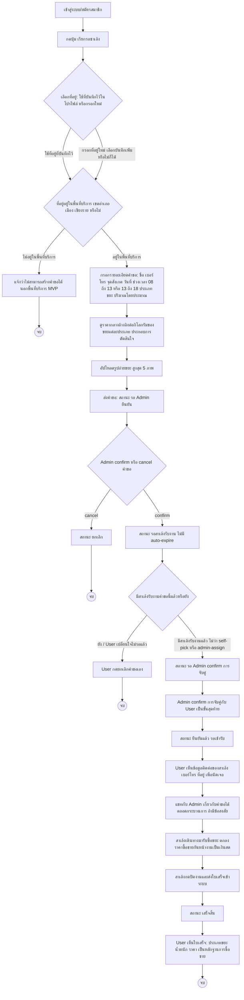

# User — สร้างและติดตามคำขอเรียกรถซาเล้ง (Pickup Request) Journey

## Persona & เป้าหมาย

**User** คือเจ้าของขยะ recycle (บ้าน/ร้านค้าเล็กในเขตอำเภอเมือง เชียงราย) ที่มีขยะสะสมอยู่และต้องการให้มีคนมารับซื้อถึงหน้าบ้าน แทนที่จะต้องขนไปขายเองที่ร้านรับซื้อของเก่า เป้าหมายของ journey นี้คือให้ User สร้างคำขอเรียกรถซาเล้ง ติดตามสถานะจนกว่าจะมีสาเล้งมารับซื้อขยะจริง และได้เห็นหลักฐานการซื้อขาย (ใบเสร็จ) เมื่องานเสร็จสิ้น

## จุดเริ่มต้น (Trigger)

User มีขยะ recycle สะสมอยู่ที่บ้าน/ร้าน และตัดสินใจเปิดเว็บแอปเพื่อเรียกรถซาเล้งแทนการขนไปขายเอง

## Diagram

## คำอธิบาย

Journey เริ่มจาก User [[../../01-requirements/feature-list#User|สมัครสมาชิก/เข้าสู่ระบบ]] เข้าสู่เว็บแอป แล้วกดปุ่ม "เรียกรถซาเล้ง" เพื่อเริ่ม [[../../01-requirements/feature-list#User|สร้างคำขอเรียกรถซาเล้งด้วยฟอร์มรายละเอียด]]

จุดตัดสินใจแรกคือการเลือกที่อยู่: User สามารถ [[../../01-requirements/feature-list#User|เลือกใช้ที่อยู่ที่บันทึกไว้ในโปรไฟล์แทนกรอกใหม่]] หรือกรอกที่อยู่ใหม่ก็ได้ ไม่ว่าจะเลือกทางไหน ระบบต้องตรวจสอบว่าที่อยู่นั้นอยู่ใน **พื้นที่ให้บริการของ MVP คือเขตอำเภอเมือง จังหวัดเชียงราย** ตาม business rule ของสเปก — ถ้าอยู่นอกพื้นที่นี้ User จะไม่สามารถสร้างคำขอต่อได้ในเวอร์ชันนี้ (การขยายพื้นที่เป็นแผนเวอร์ชันถัดไป)

เมื่อที่อยู่ผ่านการตรวจสอบแล้ว User กรอกรายละเอียดคำขอให้ครบ (ชื่อ เบอร์โทร จุดสังเกต วันที่ ช่วงเวลา 2 ช่วงให้เลือกคือ 08:00–13:00 หรือ 13:00–18:00, ประเภทขยะ, ปริมาณโดยประมาณ) ระหว่างขั้นตอนนี้ User จะเห็น [[../../01-requirements/feature-list#User|ราคากลางอ้างอิงต่อกิโลกรัมของขยะแต่ละประเภท]] ประกอบการตัดสินใจ (เป็นข้อมูลอ้างอิงเท่านั้น ไม่ผูกกับธุรกรรมจริงตาม business rule) และ [[../../01-requirements/feature-list#User|อัปโหลดรูปถ่ายขยะสูงสุด 5 ภาพ]] ก่อนกดส่งคำขอ

หลังส่งคำขอ สถานะจะเป็น "รอ Admin ยืนยัน" ซึ่งเป็นจุดตัดสินใจที่สองที่ User ควบคุมไม่ได้ — Admin จะเป็นผู้กด confirm หรือ cancel คำขอนี้ (ดู [[20260820-003-admin-request-matching-journey|Admin — Request Matching Journey]]) ถ้า cancel คำขอจะจบที่นี่ ถ้า confirm คำขอจะเข้าสู่สถานะ "รอสาเล้งรับงาน" ซึ่งตาม business rule ของสเปกจะ **ไม่มีการหมดอายุอัตโนมัติ (no auto-expire)** คำขอจะค้างสถานะนี้ไปเรื่อยๆ จนกว่าจะมีสาเล้งกดรับงาน (self-pick) หรือ Admin assign ให้สาเล้ง หรือ User [[../../01-requirements/feature-list#User|ยกเลิกคำขอได้ก่อนงานเสร็จสิ้น]] เอง

เมื่อมีสาเล้งรับงานแล้ว (ไม่ว่าจะผ่านช่องทาง self-pick หรือ admin-assign) สถานะจะเปลี่ยนเป็น "รอ Admin confirm" เสมอ ตาม business rule ที่ระบุว่า **การจับคู่งานต้องผ่าน Admin confirm กับ User เป็นขั้นตอนสุดท้ายเสมอ** ก่อนงานจะเริ่มอย่างเป็นทางการ เมื่อ Admin confirm แล้ว สถานะจะเป็น "ยืนยันแล้ว รอเข้ารับ" และ User จะ [[../../01-requirements/feature-list#User|เห็นข้อมูลติดต่อของสาเล้งที่รับงาน]] เพื่อนัดเจอ ระหว่างรอ User สามารถ [[../../01-requirements/feature-list#User|แชทกับ Admin เกี่ยวกับคำขอ]] ได้ตลอดเวลาหากมีข้อสงสัย

เมื่อสาเล้งไปถึงและซื้อขยะสำเร็จ (ราคาซื้อขายจริงตกลงกันหน้างานเป็นเงินสดตามสเปก ระบบไม่เกี่ยวข้องกับการกำหนดราคานี้) สาเล้งจะกดปิดงานและส่งใบเสร็จเข้าระบบ สถานะคำขอจึงเปลี่ยนเป็น "เสร็จสิ้น" และ User จะ[[../../01-requirements/feature-list#User|ดูใบเสร็จที่สาเล้งส่งเข้าระบบหลังงานเสร็จสิ้น]] เป็นหลักฐานการซื้อขาย ซึ่งเป็นจุดจบของ journey นี้

## เส้นทางอื่น / Edge case

- **ยกเลิกได้หลายจุด**: ตาม business rule "User หรือ saleng สามารถยกเลิกคำขอได้ก่อนงานเสร็จสิ้น" การยกเลิกไม่ได้จำกัดแค่ตอน "รอสาเล้งรับงาน" เท่านั้น แต่ทำได้แม้หลังจากมีสาเล้งรับงานแล้วและอยู่ระหว่างรอเข้ารับ (สถานะ "รอ Admin confirm" หรือ "ยืนยันแล้ว รอเข้ารับ") — ไดอะแกรมด้านบนแสดงจุดยกเลิกหลักไว้ที่ขั้น "รอสาเล้งรับงาน" เพื่อความกระชับ แต่ในทางปฏิบัติ ปุ่มยกเลิกควรพร้อมใช้งานทุกสถานะก่อน "เสร็จสิ้น"
- **สาเล้งเป็นฝ่ายยกเลิก**: กรณีสาเล้งไปไม่ถึงหรือมีเหตุสุดวิสัย สาเล้งก็ยกเลิกงานที่รับไว้ได้เช่นกัน (ดู [[20260820-002-saleng-job-fulfillment-journey|Saleng — Job Fulfillment Journey]]) ซึ่งจะทำให้คำขอกลับไปอยู่ในสถานะ "รอสาเล้งรับงาน" ให้สาเล้งคนอื่นรับต่อได้
- **บัญชีถูกระงับ**: ถ้า Admin ระงับ (suspend) บัญชี User ระหว่างทาง User จะไม่สามารถสร้างคำขอใหม่ได้อีกจนกว่าจะได้รับการปลดระงับ — สเปกไม่ได้ระบุรายละเอียดว่าคำขอที่ค้างอยู่ก่อนถูกระงับจะได้รับผลกระทบหรือไม่ **จุดนี้รอการออกแบบเพิ่มเติม**

## Reference

- [[../../01-requirements/feature-list|feature-list]]
- [[../../01-requirements/01-spec/20260819-001-saleng-pickup-request|Call-Saleng: ระบบเรียกรถซาเล้งมารับซื้อขยะ Recycle ที่บ้าน]]
- [[index|01-prototypes]]
