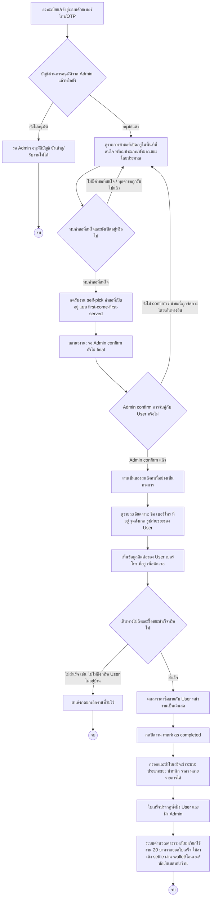

# Saleng — รับงานและปิดงาน (Job Fulfillment) Journey

## Persona & เป้าหมาย

**Saleng** คือคนขับรถซาเล้งที่รับซื้อของเก่าตามบ้าน ผ่านการอนุมัติจาก Admin แล้ว เป้าหมายของ journey นี้คือให้สาเล้งค้นหางานที่คุ้มค่าคุ้มเวลาในพื้นที่ที่สนใจ กดจองสิทธิ์รับงาน เดินทางไปรับซื้อขยะจริง แล้วปิดงานพร้อมส่งใบเสร็จเข้าระบบให้ทั้ง User และ Admin เห็น

## จุดเริ่มต้น (Trigger)

Saleng ที่ลงทะเบียนและได้รับการอนุมัติจาก Admin แล้ว เปิดเว็บแอปเพื่อดูว่ามีคำขอเปิดอยู่ในพื้นที่ที่ตนสนใจหรือไม่ และต้องการหางานรับซื้อขยะ

## Diagram

## คำอธิบาย

Journey เริ่มจากสาเล้ง [[../../01-requirements/feature-list#Saleng|ลงทะเบียน/เข้าสู่ระบบด้วยเบอร์โทร/OTP]] ตาม business rule ของสเปกที่ระบุว่าสาเล้งต้องได้รับการอนุมัติจาก Admin ก่อนจึงจะเห็นและรับงานได้ (ป้องกัน anonymous user เข้ามารับงาน) ดังนั้นจุดตัดสินใจแรกคือตรวจสอบว่าบัญชีผ่านการอนุมัติแล้วหรือยัง ถ้ายัง สาเล้งจะเข้าดูรายการงานไม่ได้จนกว่า Admin จะอนุมัติ (ดู [[20260820-004-admin-saleng-management-journey|Admin — Saleng Account Management Journey]])

เมื่อบัญชีผ่านการอนุมัติแล้ว สาเล้งจะ[[../../01-requirements/feature-list#Saleng|ดูรายการคำขอที่เปิดอยู่ในพื้นที่ที่สนใจ]] พร้อมประเภท/ปริมาณขยะโดยประมาณ เพื่อเลือกงานที่คุ้มค่าคุ้มเวลาก่อนขับรถไปรับ จุดสำคัญตรงนี้คือ business rule ที่ว่าคำขอ 1 รายการผูกกับสาเล้งได้เพียง 1 คนเท่านั้น และต้องหายไปจากรายการทันทีที่มีคนรับงานแล้ว (ไม่ว่าจะเป็น self-pick ของสาเล้งคนอื่น หรือถูก admin-assign ไปแล้ว) เพื่อป้องกันการรับงานซ้ำ ดังนั้นถ้าคำขอที่สาเล้งเล็งไว้ถูกคนอื่นรับไปก่อน สาเล้งจะต้องกลับไปดูรายการใหม่

เมื่อพบคำขอที่สนใจและยังเปิดอยู่ สาเล้งจะ[[../../01-requirements/feature-list#Saleng|กดรับงาน self-pick คำขอที่เปิดอยู่]] แบบ first-come-first-served แต่การกดรับงานนี้ **ยังไม่ final** ตาม business rule — สถานะจะเป็น "รอ Admin confirm" เท่านั้น สาเล้งต้องรอให้ Admin confirm การจับคู่นี้กับ User อีกครั้งก่อนจึงจะถือว่างานเป็นของตนอย่างเป็นทางการ (ดู [[20260820-003-admin-request-matching-journey|Admin — Request Matching Journey]] สำหรับรายละเอียดขั้นตอน confirm ของ Admin)

หลังได้รับการ confirm แล้ว สาเล้งจะ[[../../01-requirements/feature-list#Saleng|ดูรายละเอียดงานที่ต้องเข้าไปรับ]] (ชื่อ เบอร์โทร ที่อยู่ จุดสังเกต รูปถ่ายขยะของ User) และ[[../../01-requirements/feature-list#Saleng|เห็นข้อมูลติดต่อของ User เพื่อนัดเจอ]] ก่อนเดินทางไปถึงหน้างานจริง จุดตัดสินใจถัดไปคือการเดินทางไปถึงและซื้อขยะสำเร็จหรือไม่ — ถ้ามีเหตุสุดวิสัย เช่น ไปไม่ถึงหรือ User ไม่อยู่บ้าน สาเล้งสามารถ[[../../01-requirements/feature-list#Saleng|ยกเลิกงานที่รับไว้ได้ก่อนงานเสร็จสิ้น]] ตาม business rule เดียวกับฝั่ง User

ถ้าซื้อขายสำเร็จ ราคาซื้อขายจริงจะตกลงกันหน้างานเป็นเงินสด (ระบบไม่เกี่ยวข้องกับการกำหนดราคานี้) จากนั้นสาเล้ง[[../../01-requirements/feature-list#Saleng|กดปิดงาน mark as completed]] และ[[../../01-requirements/feature-list#Saleng|ส่งใบเสร็จเข้าระบบ]] โดยกรอกรายการประเภทขยะ น้ำหนัก และราคา ได้หลายรายการต่อ 1 ใบเสร็จ ตาม business rule เรื่องโครงสร้างใบเสร็จ ซึ่งใบเสร็จนี้ต้องปรากฏทั้งฝั่ง User และฝั่ง Admin สุดท้าย ระบบจะคำนวณค่าธรรมเนียมเรียกใช้งาน 20 บาทต่อคำขอจากยอดรวมในใบเสร็จ (หักออกจากเงินที่ User ได้รับจริง ไม่ใช่หักเพิ่มจากสาเล้ง) ซึ่งสาเล้งต้อง settle กับ platform ผ่าน 1 ใน 3 ช่องทางตาม business model ของสเปก (เติมเงินล่วงหน้า, โอนเงินเอง, หรือหักเป็นเงินสดหน้าร้านเครือข่าย) เป็นจุดจบของ journey นี้

## เส้นทางอื่น / Edge case

- **เส้นทาง admin-assign**: ถ้า Admin เลือก assign คำขอให้สาเล้งคนใดคนหนึ่งโดยตรง (แทนที่จะปล่อยให้ self-pick) สาเล้งจะข้ามขั้นตอน "ดูรายการคำขอ → กดรับงาน" ไปเลย โดยจะเห็นงานที่ถูก assign เข้ามาในรายการงานของตนหลังจาก Admin confirm การจับคู่กับสาเล้งขั้นแรกแล้ว จากนั้น flow จะไปต่อที่ "ดูรายละเอียดงาน" เหมือนเดิม (รอ Admin confirm กับ User อีกครั้งเป็นขั้นสุดท้ายเช่นเดียวกัน) — ดูรายละเอียดฝั่ง Admin ที่ [[20260820-003-admin-request-matching-journey|Admin — Request Matching Journey]]
- **กรณี Admin ไม่ confirm การจับคู่ self-pick**: สเปกไม่ได้ระบุชัดว่าถ้า Admin ปฏิเสธการจับคู่ที่สาเล้งกด self-pick ไว้ (ไม่ใช่แค่ยังไม่ confirm แต่ปฏิเสธจริง) จะเกิดอะไรขึ้นกับสิทธิ์ของสาเล้งคนนั้น — **จุดนี้รอการออกแบบเพิ่มเติม**
- **บัญชีถูกระงับระหว่างมีงานค้างอยู่**: ถ้า Admin ระงับบัญชีสาเล้งขณะที่มีงานที่รับไว้แล้วยังไม่เสร็จสิ้น สเปกไม่ได้ระบุว่างานนั้นจะถูกจัดการอย่างไรต่อ — **จุดนี้รอการออกแบบเพิ่มเติม**

## Reference

- [[../../01-requirements/feature-list|feature-list]]
- [[../../01-requirements/01-spec/20260819-001-saleng-pickup-request|Call-Saleng: ระบบเรียกรถซาเล้งมารับซื้อขยะ Recycle ที่บ้าน]]
- [[index|01-prototypes]]
