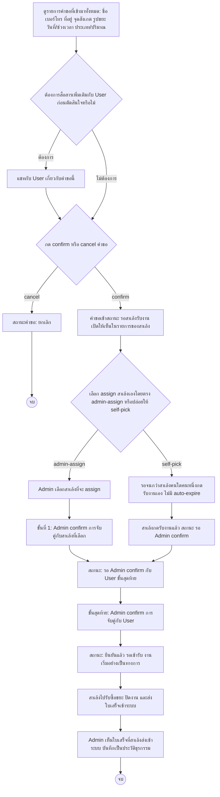

# Admin — ตรวจสอบและจับคู่คำขอ (Request Matching) Journey

## Persona & เป้าหมาย

**Admin** คือผู้ดูแลระบบ ทำหน้าที่ตรวจสอบคำขอที่ User ส่งเข้ามา ควบคุมว่าคำขอใดจะเข้าสู่กระบวนการจับคู่สาเล้งจริง และเป็นผู้ confirm การจับคู่งานระหว่าง User กับสาเล้งเป็นขั้นตอนสุดท้ายเสมอ ไม่ว่าจะจับคู่ด้วยช่องทางใด เป้าหมายของ journey นี้คือให้คำขอทุกรายการผ่านการตรวจสอบและจับคู่อย่างถูกต้องก่อนงานจะเริ่มอย่างเป็นทางการ

## จุดเริ่มต้น (Trigger)

มีคำขอใหม่จาก User เข้ามาในระบบ ที่ Admin ต้องตรวจสอบรายละเอียดและตัดสินใจว่าจะดำเนินการต่ออย่างไร

## Diagram

## คำอธิบาย

Journey เริ่มจาก Admin [[../../01-requirements/feature-list#Admin|ดูรายการคำขอที่เข้ามาทั้งหมดพร้อมรายละเอียด]] (ชื่อ เบอร์โทร ที่อยู่ จุดสังเกต รูปขยะ วันที่/ช่วงเวลาที่ต้องการ ประเภท/ปริมาณขยะโดยประมาณ) เพื่อตรวจสอบความถูกต้องก่อนดำเนินการต่อ ถ้ามีรายละเอียดที่ยังไม่ชัดเจน Admin สามารถ[[../../01-requirements/feature-list#Admin|แชทกับ user เกี่ยวกับคำขอ]] นั้นได้ก่อนตัดสินใจ

จุดตัดสินใจแรกคือ Admin [[../../01-requirements/feature-list#Admin|กด confirm หรือ cancel คำขอของ user]] ซึ่งเป็นขั้นตอนที่ควบคุมว่าคำขอใดจะเข้าสู่กระบวนการจับคู่สาเล้งจริง ถ้า cancel คำขอจะจบที่นี่ ถ้า confirm คำขอจะเข้าสถานะ "รอสาเล้งรับงาน" และเปิดให้สาเล้งเห็นในรายการงานที่เปิดอยู่ (ดู [[20260820-002-saleng-job-fulfillment-journey|Saleng — Job Fulfillment Journey]])

จุดตัดสินใจที่สองตาม business rule เรื่อง "การจับคู่งานมี 2 ช่องทางที่ต้องรองรับร่วมกัน" คือ Admin จะ[[../../01-requirements/feature-list#Admin|เลือก assign สาเล้งให้คำขอที่เปิดอยู่โดยตรง]] เอง หรือปล่อยให้สาเล้งกด self-pick เอง

- **เส้นทาง admin-assign**: Admin เลือกสาเล้งที่ต้องการ assign แล้วต้อง confirm การจับคู่กับสาเล้งคนนั้นก่อนเป็นขั้นที่ 1 ตาม business rule ที่ระบุว่ากรณีนี้มี 2 ขั้นตอน (confirm กับสาเล้งก่อน แล้วจึง confirm กับ user อีกครั้ง)
- **เส้นทาง self-pick**: ระบบรอจนกว่าสาเล้งคนใดคนหนึ่งจะกดรับงานเอง โดยคำขอจะไม่มีการหมดอายุอัตโนมัติ (no auto-expire) ตาม business rule เมื่อสาเล้งกดรับงานแล้ว สถานะจะเป็น "รอ Admin confirm" เท่านั้น เพราะการกดรับงานของสาเล้งยังไม่ final

ไม่ว่าจะมาจากเส้นทางใด ทั้งสองเส้นทางจะมาบรรจบกันที่ขั้นตอนสุดท้ายเสมอ นั่นคือ [[../../01-requirements/feature-list#Admin|Confirm การจับคู่งานกับ user เป็นขั้นตอนสุดท้ายเสมอ]] ตาม business rule ที่ยืนยันชัดเจนว่า "คำขอต้องผ่านการ confirm จาก Admin กับ user เป็นขั้นสุดท้ายเสมอ ก่อนจึงจะถือว่างานเริ่มอย่างเป็นทางการ ไม่ว่าจะจับคู่ด้วยวิธีใด" เมื่อ Admin confirm กับ User แล้ว สถานะคำขอจะเปลี่ยนเป็น "ยืนยันแล้ว รอเข้ารับ" และงานถือว่าเริ่มอย่างเป็นทางการ

หลังจากนั้นสาเล้งจะไปรับซื้อขยะ ปิดงาน และส่งใบเสร็จเข้าระบบตาม journey ของสาเล้ง เมื่อใบเสร็จถูกส่งเข้ามา Admin จะ[[../../01-requirements/feature-list#Admin|ดูใบเสร็จที่สาเล้งส่งเข้าระบบ]] ซึ่งบันทึกไว้เป็นประวัติธุรกรรมของ Admin เป็นจุดจบของ journey นี้

## เส้นทางอื่น / Edge case

- **การระงับบัญชี user**: Admin สามารถ[[../../01-requirements/feature-list#Admin|ระงับ (suspend) บัญชี user ที่ทำผิดกฎ]] ได้ทุกเมื่อ ไม่จำเป็นต้องผูกกับคำขอใดคำขอหนึ่งโดยเฉพาะ — เป็น action ที่ Admin ทำได้แยกจาก flow การจับคู่งานหลักด้านบน โดยบัญชีที่ถูกระงับจะสร้างคำขอใหม่ไม่ได้จนกว่าจะปลดระงับ
- **เปลี่ยนสาเล้งที่ assign ไปแล้ว**: สเปกไม่ได้ระบุว่าถ้า Admin ต้องการยกเลิก/เปลี่ยนตัวสาเล้งที่เลือก assign ไปแล้ว (ก่อนถึงขั้น confirm กับ User) จะทำอย่างไร — **จุดนี้รอการออกแบบเพิ่มเติม**
- **คำขอค้างนาน**: เนื่องจากไม่มี auto-expire คำขอที่ไม่มีใคร self-pick อาจค้างอยู่ในสถานะ "รอสาเล้งรับงาน" เป็นเวลานาน ซึ่งเป็นเหตุผลหนึ่งที่ business rule ให้ Admin มีทางเลือก admin-assign ไว้ช่วยจัดการกรณีคำขอค้างอยู่นานไม่มีใครรับ

## Reference

- [[../../01-requirements/feature-list|feature-list]]
- [[../../01-requirements/01-spec/20260819-001-saleng-pickup-request|Call-Saleng: ระบบเรียกรถซาเล้งมารับซื้อขยะ Recycle ที่บ้าน]]
- [[index|01-prototypes]]
