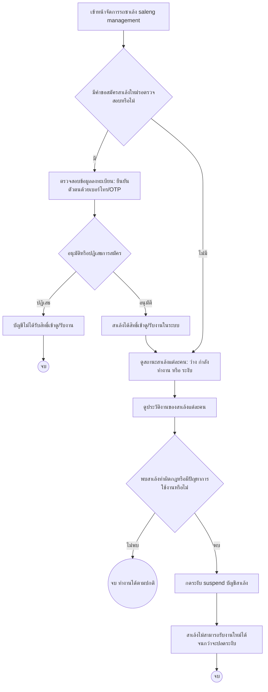

# Admin — จัดการรถซาเล้ง (Saleng Account Management) Journey

## Persona & เป้าหมาย

**Admin** ใช้หน้าจัดการรถซาเล้ง (saleng management) เพื่อควบคุมคุณภาพของผู้ให้บริการในระบบ ตั้งแต่การอนุมัติบัญชีสาเล้งใหม่ ตรวจสอบสถานะ/ประวัติงานของสาเล้งแต่ละคน ไปจนถึงการระงับบัญชีสาเล้งที่ทำผิดกฎ เป้าหมายของ journey นี้คือให้มีเพียงสาเล้งที่ผ่านการตรวจสอบแล้วเท่านั้นที่เข้าถึงและรับงานในระบบได้

## จุดเริ่มต้น (Trigger)

Admin เข้าหน้าจัดการรถซาเล้ง เพื่อตรวจสอบคำขอสมัครสาเล้งใหม่ที่ค้างอยู่ หรือเพื่อทบทวนสถานะ/ประวัติงานของสาเล้งที่มีอยู่ในระบบ

## Diagram

## คำอธิบาย

Journey เริ่มจาก Admin เข้าหน้าจัดการรถซาเล้ง ซึ่งตามสเปกครอบคลุมอย่างน้อย 4 ฟีเจอร์ในหน้าเดียวกัน จุดตัดสินใจแรกคือตรวจสอบว่ามีคำขอสมัครสาเล้งใหม่ค้างอยู่หรือไม่ ถ้ามี Admin จะ[[../../01-requirements/feature-list#Admin|อนุมัติการสมัครของสาเล้งใหม่ (หน้าจัดการรถซาเล้ง)]] โดยตรวจสอบข้อมูลลงทะเบียนซึ่งตาม business rule ของสเปก **ใช้การยืนยันตัวตนด้วยเบอร์โทร/OTP เท่านั้น** ไม่ต้องอัปโหลดเอกสารทะเบียนรถหรือบัตรประชาชน หาก Admin อนุมัติ สาเล้งจะได้สิทธิ์เข้าดูและรับงานในระบบทันที (ดู [[20260820-002-saleng-job-fulfillment-journey|Saleng — Job Fulfillment Journey]]) แต่ถ้าปฏิเสธ บัญชีนั้นจะยังไม่ได้รับสิทธิ์ ตาม business rule ที่ระบุว่าสาเล้งต้องได้รับการอนุมัติก่อนจึงจะเห็นและรับงานได้ (ป้องกัน anonymous user หรือสาเล้งที่ไม่ผ่านการตรวจสอบเข้ามารับงาน)

ไม่ว่าจะมีคำขอสมัครใหม่หรือไม่ Admin ยัง[[../../01-requirements/feature-list#Admin|ดูสถานะสาเล้งแต่ละคน (หน้าจัดการรถซาเล้ง)]] (เช่น ว่าง / กำลังทำงาน / ระงับ) และ[[../../01-requirements/feature-list#Admin|ดูประวัติงานของสาเล้งแต่ละคน (หน้าจัดการรถซาเล้ง)]] เพื่อตรวจสอบย้อนหลังงานที่สาเล้งแต่ละคนเคยรับ ข้อมูลเหล่านี้ใช้ประกอบการตัดสินใจในจุดตัดสินใจสุดท้ายว่าพบสาเล้งที่ทำผิดกฎหรือมีปัญหาการใช้งานหรือไม่ ถ้าไม่พบปัญหา สาเล้งก็ทำงานต่อไปได้ตามปกติ แต่ถ้าพบปัญหา Admin จะ[[../../01-requirements/feature-list#Admin|ระงับ (suspend) บัญชีสาเล้ง (หน้าจัดการรถซาเล้ง)]] ซึ่งตาม business rule จะทำให้บัญชีนั้นไม่สามารถรับงานใหม่ได้อีกจนกว่าจะได้รับการปลดระงับ

## เส้นทางอื่น / Edge case

- **ปลดระงับบัญชี**: สเปกระบุว่าบัญชีที่ถูกระงับจะกลับมารับงานได้อีกครั้ง "จนกว่าจะได้รับการปลดระงับ" แต่ไม่ได้อธิบายรายละเอียดขั้นตอนหรือเงื่อนไขการปลดระงับไว้ชัดเจน — **จุดนี้รอการออกแบบเพิ่มเติม**
- **งานค้างอยู่ตอนถูกระงับ**: ถ้าสาเล้งมีงานที่รับไว้แล้วยังไม่เสร็จสิ้นในขณะที่ถูกระงับบัญชี สเปกไม่ได้ระบุว่างานนั้นจะถูกจัดการต่ออย่างไร (เช่น กลับไปเป็น "รอสาเล้งรับงาน" ให้คนอื่นรับต่อหรือไม่) — **จุดนี้รอการออกแบบเพิ่มเติม**

## Reference

- [[../../01-requirements/feature-list|feature-list]]
- [[../../01-requirements/01-spec/20260819-001-saleng-pickup-request|Call-Saleng: ระบบเรียกรถซาเล้งมารับซื้อขยะ Recycle ที่บ้าน]]
- [[index|01-prototypes]]
