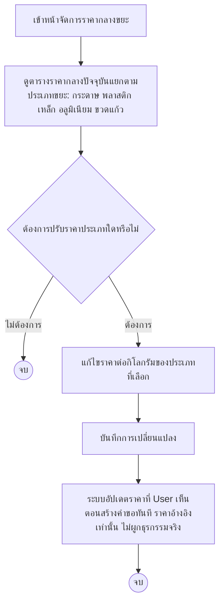

# Admin — อัปเดตราคากลางขยะ (Price Management) Journey

## Persona & เป้าหมาย

**Admin** เป็นผู้เดียวที่ตั้งและอัปเดตราคากลางอ้างอิงต่อกิโลกรัมของขยะแต่ละประเภท (เช่น กระดาษ พลาสติก เหล็ก อลูมิเนียม ขวดแก้ว) เป้าหมายของ journey นี้คือให้ราคาอ้างอิงที่ User เห็นตอนสร้างคำขอใกล้เคียงกับราคาตลาดปัจจุบันมากที่สุด

## จุดเริ่มต้น (Trigger)

Admin ต้องการตั้งหรือปรับราคากลางอ้างอิงต่อกิโลกรัมของขยะแต่ละประเภท ให้สอดคล้องกับราคาตลาดที่เปลี่ยนแปลงไป

## Diagram

## คำอธิบาย

Journey นี้สั้นและไม่มีสาขาซับซ้อน เพราะเป็นฟังก์ชันบริหารข้อมูลอ้างอิง (reference data) ล้วนๆ ไม่ได้ผูกกับ lifecycle ของคำขอโดยตรง Admin เข้าหน้าจัดการราคากลางขยะแล้วดูตารางราคาปัจจุบันแยกตามประเภทขยะ จุดตัดสินใจเดียวของ journey นี้คือ Admin ต้องการปรับราคาประเภทใดหรือไม่ ถ้าไม่ต้องการก็จบ journey ทันที ถ้าต้องการ Admin จะ[[../../01-requirements/feature-list#Admin|อัปเดตราคากลางขยะต่อกิโลกรัมของแต่ละประเภท]] แล้วบันทึกการเปลี่ยนแปลง

หลังบันทึกแล้ว ระบบจะอัปเดตราคาที่ User เห็นทันทีตอนสร้างคำขอ (ดู [[20260820-001-user-pickup-request-journey|User — Pickup Request Journey]] ที่ User [[../../01-requirements/feature-list#User|ดูราคากลางอ้างอิงต่อกิโลกรัม]] ประกอบการตัดสินใจ) ตาม business rule ของสเปกที่ระบุชัดว่า **ราคากลางอ้างอิงต่อกิโลกรัมของขยะแต่ละประเภทตั้ง/อัปเดตได้โดย Admin เท่านั้น** และเป็นเพียงข้อมูลอ้างอิงให้ User ประกอบการตัดสินใจ ไม่ใช่ราคาที่ผูกมัดกับธุรกรรมจริง (ราคาซื้อขายจริงยังตกลงหน้างานระหว่าง User และ Saleng ตามเดิม)

## เส้นทางอื่น / Edge case

- สเปกไม่ได้ระบุว่าการเปลี่ยนราคากลางมีผลย้อนหลังกับคำขอที่ User สร้างไว้ก่อนหน้าหรือไม่ (เช่น คำขอที่ยัง "รอสาเล้งรับงาน" อยู่ควรแสดงราคา ณ ตอนสร้างคำขอ หรือราคาล่าสุดเสมอ) — **จุดนี้รอการออกแบบเพิ่มเติม**
- ไม่มี business rule ระบุเรื่องการเก็บ history ของการเปลี่ยนราคาแต่ละครั้ง (audit trail) — หากต้องการ ควรเปิดเป็นคำถามใหม่แยกต่างหากในขั้นตอนออกแบบเชิงเทคนิคถัดไป

## Reference

- [[../../01-requirements/feature-list|feature-list]]
- [[../../01-requirements/01-spec/20260819-001-saleng-pickup-request|Call-Saleng: ระบบเรียกรถซาเล้งมารับซื้อขยะ Recycle ที่บ้าน]]
- [[index|01-prototypes]]
