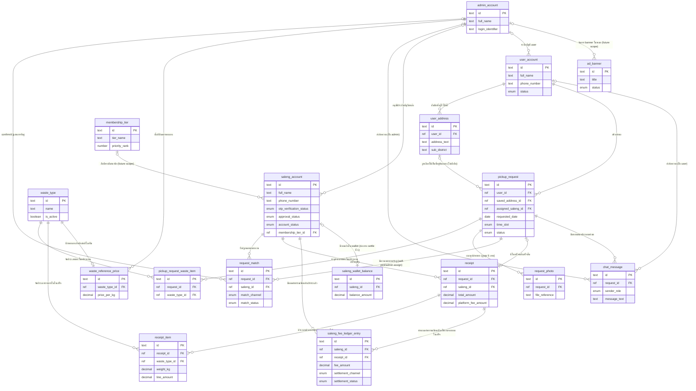

# Database Schema (Conceptual)

> เอกสารนี้อธิบายโครงสร้างข้อมูลในระดับแนวคิด (conceptual) เท่านั้น **ไม่ผูกมัดกับ database engine หรือ data type เฉพาะเจาะจงใดๆ** การเลือก engine จริงจะอยู่ในเอกสารแยกต่างหากภายใต้โฟลเดอร์เดียวกันนี้เมื่อถึงขั้นตอนออกแบบเชิงเทคนิค

## ภาพรวม

เอกสารนี้สกัดโครงสร้างข้อมูลจาก [[../../01-requirements/01-spec/20260819-001-saleng-pickup-request|Call-Saleng: ระบบเรียกรถซาเล้งมารับซื้อขยะ Recycle ที่บ้าน]] ทั้งฉบับ ครอบคลุมทั้ง 3 บทบาท (User/Saleng/Admin) โดยอ้างอิงชื่อ component เชิงแนวคิดจาก [[high-level-architecture|High-Level Architecture (Conceptual)]] ให้สอดคล้องกัน — โดยเฉพาะ **Data Store** (เก็บบัญชี/คำขอ/การจับคู่/ใบเสร็จ/ราคากลาง), **Media/File Storage** (เก็บรูปถ่ายขยะแยกต่างหาก — ในเอกสารนี้ตาราง `request_photo` เก็บเพียง reference ไปยังไฟล์ ไม่ใช่ไฟล์จริง) และ **Matching/Assignment** (สะท้อนเป็นตาราง `request_match` แยกจากตาราง `pickup_request` หลัก เพื่อรองรับกลไก self-pick/admin-assign และเตรียมพร้อมสำหรับ auto-matching ในอนาคตตามที่ระบุใน high-level-architecture)

แบ่งกลุ่มตารางออกเป็น 6 กลุ่มตามบทบาทและ business rule ของสเปก:

1. **บัญชีผู้ใช้ทั้ง 3 บทบาท** — `user_account`, `user_address`, `saleng_account`, `admin_account`
2. **คำขอเรียกรถซาเล้งและรายละเอียดประกอบ** — `pickup_request`, `pickup_request_waste_item`, `request_photo`
3. **ราคากลางอ้างอิง** — `waste_type`, `waste_reference_price`
4. **การจับคู่งาน (self-pick / admin-assign)** — `request_match`
5. **ใบเสร็จและค่าธรรมเนียม platform** — `receipt`, `receipt_item`, `saleng_fee_ledger_entry`, `saleng_wallet_balance`
6. **การสื่อสาร** — `chat_message`
7. **เผื่อรองรับโมเดลธุรกิจในอนาคต (future scope, minimal)** — `membership_tier`, `ad_banner`

## ER Diagram

## รายละเอียดตาราง

### user_account

เก็บบัญชี User/เจ้าของขยะ ตาม [[../../01-requirements/feature-list#User|สมัครสมาชิก/เข้าสู่ระบบ]] และ [[../../01-requirements/feature-list#User|จัดการโปรไฟล์ส่วนตัว]] `phone_number` ใช้เป็นข้อมูลติดต่อที่ส่งต่อให้สาเล้งเห็นหลัง match confirm ตาม business rule เรื่องการแลกข้อมูลติดต่อ

| Field | Type | Required | คำอธิบาย |
|---|---|---|---|
| id | text | ใช่ | รหัสอ้างอิงเฉพาะของบัญชี |
| full_name | text | ใช่ | ชื่อผู้ใช้ ใช้เป็นค่าเริ่มต้นของ `contact_name` ตอนสร้างคำขอ |
| phone_number | text | ใช่ | เบอร์โทรติดต่อ, unique, ใช้เป็นค่าเริ่มต้นของ `contact_phone` และเป็นข้อมูลที่ส่งให้สาเล้งเห็นหลัง confirm |
| status | enum | ใช่ | `active` / `suspended` — ตาม business rule "Admin ระงับบัญชี user ที่ทำผิดกฎ" บัญชี `suspended` ไม่สามารถสร้างคำขอใหม่ได้ |
| created_at | datetime | ใช่ | วันเวลาที่สมัครสมาชิก |
| suspended_at | datetime | ไม่ | วันเวลาที่ถูกระงับ (null ถ้ายัง active) |
| suspended_by | reference → admin_account | ไม่ | Admin ที่กดระงับบัญชีนี้ |
| suspend_reason | text | ไม่ | เหตุผลการระงับ เพื่อใช้อ้างอิงภายหลัง |

### user_address

รองรับ [[../../01-requirements/feature-list#User|เลือกใช้ที่อยู่ที่บันทึกไว้ในโปรไฟล์แทนกรอกใหม่]] เป็นที่อยู่ "ต้นแบบ" ที่ User เลือกดึงมาใช้ตอนสร้างคำขอได้ — ไม่ใช่ที่อยู่จริงที่ผูกกับคำขอแต่ละครั้ง (ที่อยู่จริงของคำขอถูก snapshot แยกไว้ใน `pickup_request` เพื่อไม่ให้เปลี่ยนย้อนหลังถ้า User แก้ไขที่อยู่ในโปรไฟล์ภายหลัง)

| Field | Type | Required | คำอธิบาย |
|---|---|---|---|
| id | text | ใช่ | รหัสอ้างอิงที่อยู่ |
| user_id | reference → user_account | ใช่ | เจ้าของที่อยู่นี้ |
| label | text | ไม่ | ป้ายกำกับที่อยู่ เช่น "บ้าน", "ร้าน" |
| address_text | text | ใช่ | รายละเอียดที่อยู่ |
| sub_district | text | ไม่ | ตำบล/พื้นที่ย่อยภายในเขตอำเภอเมือง เชียงราย ใช้ประกอบการกรองรายการของสาเล้ง (ดูหมายเหตุใน "สมมติฐานและข้อจำกัด") |
| landmark | text | ไม่ | จุดสังเกตเพิ่มเติม |
| gps_latitude | decimal | ไม่ | พิกัด GPS (ทางเลือกแทน/เสริมที่อยู่ ตาม business rule "ที่อยู่ หรือพิกัด GPS") |
| gps_longitude | decimal | ไม่ | พิกัด GPS |
| is_default | boolean | ใช่ | ที่อยู่เริ่มต้นที่แนะนำตอนสร้างคำขอ |
| created_at | datetime | ใช่ | วันเวลาที่บันทึกที่อยู่นี้ |

### saleng_account

เก็บบัญชี Saleng/คนขับ ตาม [[../../01-requirements/feature-list#Saleng|ลงทะเบียน/เข้าสู่ระบบด้วยเบอร์โทร/OTP]] บังคับใช้ business rule "สาเล้งต้องได้รับการอนุมัติจาก Admin ก่อนจึงจะเห็นและรับงานได้" ผ่าน `approval_status` แยกจาก `account_status` (สถานะระงับ) เพื่อให้ตรวจสอบเงื่อนไข "อนุมัติแล้ว" และ "ไม่ถูกระงับ" ได้อิสระจากกัน

| Field | Type | Required | คำอธิบาย |
|---|---|---|---|
| id | text | ใช่ | รหัสอ้างอิงบัญชีสาเล้ง |
| full_name | text | ใช่ | ชื่อสาเล้ง |
| phone_number | text | ใช่ | เบอร์โทร, unique, ใช้ยืนยันตัวตนด้วย OTP และเป็นข้อมูลที่ส่งให้ User เห็นหลัง confirm |
| otp_verification_status | enum | ใช่ | `verified` / `unverified` — ผลการยืนยันตัวตนผ่าน External Identity Verification ตอนลงทะเบียน/เข้าสู่ระบบ |
| approval_status | enum | ใช่ | `pending` / `approved` / `rejected` — ผลการตรวจสอบของ Admin ก่อนให้สิทธิ์เข้าดู/รับงาน |
| account_status | enum | ใช่ | `active` / `suspended` — Admin ระงับได้ทุกเมื่อ, บัญชี `suspended` รับงานใหม่ไม่ได้ |
| membership_tier_id | reference → membership_tier | ไม่ | **เผื่อรองรับอนาคต**: ระดับสมาชิกรายเดือน (ยังไม่มีฟีเจอร์จริงใน MVP เพราะค่าสมาชิกชำระ manual นอกระบบ) |
| created_at | datetime | ใช่ | วันเวลาที่ลงทะเบียน |
| approved_at / approved_by | datetime / reference → admin_account | ไม่ | วันเวลาและ Admin ผู้ตรวจสอบตอนอนุมัติ |
| suspended_at / suspended_by / suspend_reason | datetime / reference → admin_account / text | ไม่ | ข้อมูลการระงับบัญชี เช่นเดียวกับ `user_account` |

หมายเหตุ: สถานะ "ว่าง / กำลังทำงาน" ที่ Admin เห็นในหน้าจัดการรถซาเล้ง ([[../../01-requirements/feature-list#Admin|ดูสถานะสาเล้งแต่ละคน]]) เป็นค่าที่ **คำนวณ (derived)** จากการมี/ไม่มี `request_match` ที่ `match_status = confirmed` และ `pickup_request` ที่เกี่ยวข้องยังไม่ `completed`/`cancelled` ของสาเล้งคนนั้น ไม่ได้เก็บเป็น field แยกต่างหากในตารางนี้ เพื่อไม่ให้ข้อมูลไม่ตรงกับความจริง (single source of truth มาจาก `request_match`)

### admin_account

เก็บบัญชี Admin/ผู้ดูแลระบบ ออกแบบขั้นต่ำเพราะสเปกไม่ได้ระบุรายละเอียดการสมัคร/สิทธิ์ของ Admin (สันนิษฐานว่าเป็นบัญชีที่สร้างไว้ล่วงหน้า ไม่มีขั้นตอนสมัครสมาชิกแบบ User/Saleng)

| Field | Type | Required | คำอธิบาย |
|---|---|---|---|
| id | text | ใช่ | รหัสอ้างอิงบัญชี Admin |
| full_name | text | ใช่ | ชื่อผู้ดูแลระบบ |
| login_identifier | text | ใช่ | ข้อมูลใช้เข้าสู่ระบบ (unique) เชิงแนวคิด ไม่ผูกรูปแบบ auth เฉพาะเจาะจง |
| created_at | datetime | ใช่ | วันเวลาที่สร้างบัญชี |

### waste_type

ตารางอ้างอิงประเภทขยะ recycle (กระดาษ, พลาสติก, เหล็ก, อลูมิเนียม, ขวดแก้ว ฯลฯ) ใช้ร่วมกันทั้งตอน User เลือกประเภทขยะในคำขอ, Admin ตั้งราคากลาง, และสาเล้งกรอกใบเสร็จ — ดูเหตุผลการเลือก normalize แบบตารางอ้างอิงใน "สมมติฐานและข้อจำกัด"

| Field | Type | Required | คำอธิบาย |
|---|---|---|---|
| id | text | ใช่ | รหัสอ้างอิงประเภทขยะ |
| name | text | ใช่ | ชื่อประเภท (unique) เช่น "พลาสติก" |
| is_active | boolean | ใช่ | ใช้ปิดการใช้งานประเภทที่เลิกรับซื้อ โดยไม่ต้องลบข้อมูลย้อนหลัง |
| created_at | datetime | ใช่ | วันเวลาที่เพิ่มประเภทนี้เข้าระบบ |

### waste_reference_price

ราคากลางอ้างอิงต่อกิโลกรัมของแต่ละประเภท ตาม [[../../01-requirements/feature-list#Admin|อัปเดตราคากลางขยะต่อกิโลกรัมของแต่ละประเภท]] — เป็นราคาปัจจุบันเท่านั้น (ไม่มี audit trail แบบตารางประวัติแยก ตามที่ตัดสินใจไว้ใน "สมมติฐานและข้อจำกัด")

| Field | Type | Required | คำอธิบาย |
|---|---|---|---|
| id | text | ใช่ | รหัสอ้างอิง |
| waste_type_id | reference → waste_type | ใช่ | ประเภทขยะที่ราคานี้ผูกอยู่ (unique — 1 ประเภทมีราคากลางปัจจุบันได้ 1 ค่า) |
| price_per_kg | decimal | ใช่ | ราคาอ้างอิงต่อกิโลกรัม (บาท) — เป็นข้อมูลอ้างอิงเท่านั้น ไม่ผูกกับธุรกรรมจริงตาม business rule |
| updated_at | datetime | ใช่ | วันเวลาที่แก้ไขล่าสุด |
| updated_by | reference → admin_account | ใช่ | Admin ที่แก้ไขราคาล่าสุด |

### pickup_request

ตารางหลักของระบบ แทนคำขอเรียกรถซาเล้ง 1 รายการ ครอบคลุมฟอร์มตาม [[../../01-requirements/feature-list#User|สร้างคำขอเรียกรถซาเล้งด้วยฟอร์มรายละเอียด]] และ business rule "พื้นที่ให้บริการจำกัดเฉพาะเขตอำเภอเมือง เชียงราย" (ตรวจสอบก่อนสร้าง ไม่ได้เก็บเป็น field พิเศษ) ที่อยู่ในตารางนี้เป็น **snapshot ณ ตอนสร้างคำขอ** แยกจาก `user_address` เพื่อไม่ให้ข้อมูลของคำขอเก่าเปลี่ยนตามถ้า User แก้ไขที่อยู่ในโปรไฟล์ภายหลัง

| Field | Type | Required | คำอธิบาย |
|---|---|---|---|
| id | text | ใช่ | รหัสอ้างอิงคำขอ |
| user_id | reference → user_account | ใช่ | User เจ้าของคำขอ |
| saved_address_id | reference → user_address | ไม่ | ที่อยู่ต้นแบบที่ถูกเลือกใช้ (null ถ้ากรอกที่อยู่ใหม่โดยไม่บันทึก) |
| contact_name | text | ใช่ | ชื่อผู้ติดต่อของคำขอนี้ (ดึงจาก profile หรือกรอกใหม่) |
| contact_phone | text | ใช่ | เบอร์โทรติดต่อของคำขอนี้ |
| address_text | text | ใช่ | ที่อยู่ (snapshot) |
| sub_district | text | ไม่ | ตำบล/พื้นที่ย่อย (snapshot) ใช้กรองรายการของสาเล้ง |
| landmark | text | ไม่ | จุดสังเกต (snapshot) |
| gps_latitude / gps_longitude | decimal | ไม่ | พิกัด GPS (snapshot) |
| requested_date | date | ใช่ | วันที่ต้องการให้เข้ารับ |
| time_slot | enum | ใช่ | `08:00-13:00` / `13:00-18:00` |
| estimated_quantity_description | text | ใช่ | ปริมาณโดยประมาณ (เช่น น้อย/กลาง/มาก หรือประมาณกี่กิโลกรัม) |
| status | enum | ใช่ | `pending_admin_review` / `cancelled` / `open_for_saleng` / `pending_match_confirm` / `confirmed` / `completed` — สถานะหลักที่ User/Saleng/Admin เห็นตรงกัน (single source of truth) |
| assigned_saleng_id | reference → saleng_account | ไม่ | สาเล้งที่กำลังผูกกับคำขอนี้อยู่ ณ ปัจจุบัน (ค่าล่าสุดจาก `request_match` ที่ยัง active — ดูรายละเอียดกระบวนการจับคู่เต็มรูปแบบที่ตาราง `request_match`) |
| admin_reviewed_at / admin_reviewed_by | datetime / reference → admin_account | ไม่ | เวลาและผู้ที่ confirm/cancel คำขอขั้นแรก |
| final_confirmed_at / final_confirmed_by | datetime / reference → admin_account | ไม่ | เวลาและผู้ที่ confirm การจับคู่ขั้นสุดท้ายกับ User |
| completed_at | datetime | ไม่ | เวลาที่สาเล้งกดปิดงาน |
| cancelled_at | datetime | ไม่ | เวลาที่ยกเลิก |
| cancelled_by | enum | ไม่ | `user` / `saleng` / `admin` — ผู้ที่ยกเลิกคำขอ/งานนี้ |
| cancel_reason | text | ไม่ | เหตุผลการยกเลิก |
| created_at | datetime | ใช่ | วันเวลาที่สร้างคำขอ |

หมายเหตุ business rule "no auto-expire": คำขอที่ `status = open_for_saleng` จะไม่ถูกเปลี่ยนสถานะโดยอัตโนมัติจาก timeout ใดๆ ต้องรอ action ของ User (ยกเลิก), Saleng (self-pick) หรือ Admin (assign) เท่านั้น

### pickup_request_waste_item

รายการประเภทขยะโดยประมาณของคำขอ 1 รายการ ออกแบบให้เลือกได้มากกว่า 1 ประเภทต่อคำขอ (บ้าน/ร้านมักมีขยะ recycle ปนกันหลายประเภท) — ดูเหตุผลใน "สมมติฐานและข้อจำกัด"

| Field | Type | Required | คำอธิบาย |
|---|---|---|---|
| id | text | ใช่ | รหัสอ้างอิง |
| request_id | reference → pickup_request | ใช่ | คำขอที่รายการนี้สังกัด |
| waste_type_id | reference → waste_type | ใช่ | ประเภทขยะที่เลือก |
| quantity_note | text | ไม่ | หมายเหตุปริมาณเฉพาะประเภทนี้ (ทางเลือกเสริม นอกเหนือจาก `estimated_quantity_description` ของคำขอโดยรวม) |

### request_photo

รูปถ่ายขยะที่แนบกับคำขอ เก็บเฉพาะ reference ไปยังไฟล์จริงใน Media/File Storage (ตาม high-level-architecture ที่แยก component นี้ออกจาก Data Store หลัก)

| Field | Type | Required | คำอธิบาย |
|---|---|---|---|
| id | text | ใช่ | รหัสอ้างอิง |
| request_id | reference → pickup_request | ใช่ | คำขอที่รูปนี้สังกัด |
| file_reference | text | ใช่ | ตัวชี้ไปยังไฟล์จริงใน Media/File Storage (เช่น key/URL เชิงแนวคิด) |
| display_order | number | ไม่ | ลำดับการแสดงผล |
| uploaded_at | datetime | ใช่ | วันเวลาที่อัปโหลด |

Constraint: จำนวนแถวของ `request_photo` ต่อ `request_id` ต้องไม่เกิน **5** ตาม business rule "จำนวนรูปถ่ายขยะที่อัปโหลดได้ต่อคำขอ จำกัดไม่เกิน 5 ภาพ"

### request_match

บันทึกความพยายามจับคู่งานแต่ละครั้งของคำขอ 1 รายการ (แยกจาก `pickup_request` เพื่อรองรับทั้ง self-pick, admin-assign, การปฏิเสธ, และการจับคู่ซ้ำหลังถูกปฏิเสธ/ยกเลิก — สอดคล้องกับ **Matching/Assignment** component ที่แยกออกจาก Core Application Layer ใน high-level-architecture)

| Field | Type | Required | คำอธิบาย |
|---|---|---|---|
| id | text | ใช่ | รหัสอ้างอิง |
| request_id | reference → pickup_request | ใช่ | คำขอที่พยายามจับคู่ |
| saleng_id | reference → saleng_account | ใช่ | สาเล้งที่ self-pick หรือถูก assign |
| match_channel | enum | ใช่ | `self_pick` / `admin_assign` |
| match_status | enum | ใช่ | `pending_admin_confirm_saleng` (เฉพาะ admin-assign — รอ Admin confirm ขั้นที่ 1 กับสาเล้งที่เลือก) / `pending_admin_confirm_user` (รอ Admin confirm ขั้นสุดท้ายกับ User — self-pick มาถึงสถานะนี้ทันที) / `confirmed` / `rejected` / `cancelled` / `superseded` (ถูกแทนที่ด้วยการจับคู่รอบใหม่) |
| created_at | datetime | ใช่ | เวลาที่ self-pick/assign เกิดขึ้น |
| confirmed_at / confirmed_by | datetime / reference → admin_account | ไม่ | เวลาและ Admin ที่ confirm (ใช้ทั้งขั้นที่ 1 และขั้นสุดท้าย แยกดูได้จาก `match_status` ณ ขณะนั้น) |
| rejected_at / rejected_by | datetime / reference → admin_account | ไม่ | เวลาและ Admin ที่ปฏิเสธการจับคู่นี้ |
| reject_reason | text | ไม่ | เหตุผลการปฏิเสธ |

Business rule ที่ตารางนี้บังคับใช้: คำขอ 1 รายการมี `request_match` ที่ `match_status` อยู่ในกลุ่ม "active" (`pending_admin_confirm_saleng`, `pending_admin_confirm_user`, `confirmed`) ได้ไม่เกิน 1 แถวพร้อมกันเสมอ (ป้องกันรับงานซ้ำ) — เมื่อแถวหนึ่งถูก `confirmed` แล้ว `pickup_request.assigned_saleng_id` และ `pickup_request.status` จะถูกอัปเดตตาม

### receipt

ใบเสร็จที่สาเล้งส่งเข้าระบบหลังปิดงาน ตาม [[../../01-requirements/feature-list#Saleng|ส่งใบเสร็จเข้าระบบ]] — 1 คำขอมีใบเสร็จได้สูงสุด 1 ใบ (สร้างหลัง `pickup_request.status = completed`)

| Field | Type | Required | คำอธิบาย |
|---|---|---|---|
| id | text | ใช่ | รหัสอ้างอิงใบเสร็จ |
| request_id | reference → pickup_request | ใช่ | คำขอที่ใบเสร็จนี้สังกัด (unique) |
| saleng_id | reference → saleng_account | ใช่ | สาเล้งผู้ส่งใบเสร็จ |
| submitted_at | datetime | ใช่ | วันเวลาที่ส่งใบเสร็จ |
| total_amount | decimal | ใช่ | ยอดรวมของใบเสร็จ (ผลรวมของ `receipt_item.line_amount` ทั้งหมด) |
| platform_fee_amount | decimal | ใช่ | ค่าธรรมเนียมเรียกใช้งานที่คำนวณจาก `total_amount` (MVP = 20 บาทคงที่ต่อคำขอที่สำเร็จ แต่เก็บเป็น field แยกเพื่อรองรับการเปลี่ยนอัตราในอนาคตโดยไม่กระทบใบเสร็จเก่า) |
| user_received_amount | decimal | ใช่ | ยอดที่ User ได้รับจริง = `total_amount` − `platform_fee_amount` |

### receipt_item

รายการย่อยของใบเสร็จ ตาม business rule "โครงสร้างใบเสร็จ...มีได้หลายรายการต่อ 1 ใบเสร็จ"

| Field | Type | Required | คำอธิบาย |
|---|---|---|---|
| id | text | ใช่ | รหัสอ้างอิง |
| receipt_id | reference → receipt | ใช่ | ใบเสร็จที่รายการนี้สังกัด |
| waste_type_id | reference → waste_type | ใช่ | ประเภทขยะของรายการนี้ |
| weight_kg | decimal | ใช่ | น้ำหนักที่ซื้อขายจริง (กิโลกรัม) |
| line_amount | decimal | ใช่ | ราคาของรายการนี้ (บาท) — ตอบโจทย์ business rule "ราคาต่อประเภท"; ผลรวมของทุกรายการ = `receipt.total_amount` ("ราคารวม") |

### saleng_fee_ledger_entry

บันทึกยอดค่าธรรมเนียมเรียกใช้งาน (platform fee) ที่สาเล้งค้างชำระ/ชำระแล้วต่อ platform ต่อ 1 ใบเสร็จ ตาม business rule "ระบบต้องบันทึกมูลค่าการขายและคำนวณยอดค่าธรรมเนียมที่สาเล้งค้างชำระ/ชำระแล้วให้ platform ไว้ในระบบ" (ยังไม่มี payment gateway ตัดเงินจริงใน MVP — ตารางนี้เป็นบันทึกยอดเท่านั้น)

| Field | Type | Required | คำอธิบาย |
|---|---|---|---|
| id | text | ใช่ | รหัสอ้างอิง |
| saleng_id | reference → saleng_account | ใช่ | สาเล้งเจ้าของยอดนี้ |
| receipt_id | reference → receipt | ใช่ | ใบเสร็จต้นทางที่คำนวณค่าธรรมเนียมนี้มา (unique — 1 ใบเสร็จมี 1 รายการค่าธรรมเนียม) |
| fee_amount | decimal | ใช่ | จำนวนเงินค่าธรรมเนียม (คัดลอกมาจาก `receipt.platform_fee_amount` ณ เวลาที่สร้าง) |
| settlement_channel | enum | ไม่ | `prepaid_wallet` / `manual_transfer` / `cash_at_partner_shop` — เลือกเมื่อสาเล้ง settle แล้วเท่านั้น (null ระหว่างยังค้างชำระ) |
| settlement_status | enum | ใช่ | `pending` / `settled` |
| settled_at | datetime | ไม่ | วันเวลาที่ settle สำเร็จ |
| note | text | ไม่ | หมายเหตุ (เช่น เลขอ้างอิงการโอนเงินกรณี manual_transfer) |
| created_at | datetime | ใช่ | วันเวลาที่เกิดยอดค้างนี้ (พร้อมกับใบเสร็จ) |

### saleng_wallet_balance

ยอดเงินคงเหลือใน wallet ของสาเล้งในระบบ รองรับช่องทาง settle แบบ "เติมเงินล่วงหน้า" — เป็นการบันทึกยอดเชิงบัญชีเท่านั้น ไม่มีการตัดเงินจริงผ่าน payment gateway ใน MVP

| Field | Type | Required | คำอธิบาย |
|---|---|---|---|
| id | text | ใช่ | รหัสอ้างอิง |
| saleng_id | reference → saleng_account | ใช่ | เจ้าของ wallet (unique — 1 สาเล้งมี 1 wallet) |
| balance_amount | decimal | ใช่ | ยอดคงเหลือปัจจุบัน (บาท) |
| updated_at | datetime | ใช่ | วันเวลาที่ยอดเปลี่ยนแปลงล่าสุด (เติมเงินหรือถูกหักอัตโนมัติตอนปิดงาน) |

### chat_message

ข้อความแชทระหว่าง User และ Admin เกี่ยวกับคำขอหนึ่งรายการ ตาม [[../../01-requirements/feature-list#User|แชทกับ Admin เกี่ยวกับคำขอ]] / [[../../01-requirements/feature-list#Admin|แชทกับ user เกี่ยวกับคำขอ]]

| Field | Type | Required | คำอธิบาย |
|---|---|---|---|
| id | text | ใช่ | รหัสอ้างอิง |
| request_id | reference → pickup_request | ใช่ | คำขอที่บทสนทนานี้เกี่ยวข้อง |
| sender_role | enum | ใช่ | `user` / `admin` |
| sender_id | text | ใช่ | อ้างอิงไปยัง `user_account.id` หรือ `admin_account.id` ตามค่า `sender_role` |
| message_text | text | ใช่ | เนื้อหาข้อความ |
| sent_at | datetime | ใช่ | วันเวลาที่ส่ง |

### membership_tier (เผื่อรองรับอนาคต)

**หมายเหตุ: เผื่อรองรับโมเดลธุรกิจ "ค่าสมาชิกรายเดือนสำหรับสาเล้ง...แบบมีระดับ/ลำดับความสำคัญ" ในอนาคต ไม่ใช่ฟีเจอร์ที่พัฒนาจริงใน MVP นี้ (ค่าสมาชิกยังชำระเป็นเงินสด/โอนเงินเองนอกระบบ)** ตารางนี้เก็บเพียงโครงสร้างขั้นต่ำเพื่อไม่ต้องแก้ schema เมื่อเปิดใช้ฟีเจอร์จริงในอนาคต

| Field | Type | Required | คำอธิบาย |
|---|---|---|---|
| id | text | ใช่ | รหัสอ้างอิง |
| tier_name | text | ใช่ | ชื่อระดับสมาชิก |
| priority_rank | number | ใช่ | ลำดับความสำคัญ (ตัวเลขยิ่งสูง/ต่ำ = สิทธิ์ยิ่งมาก แล้วแต่การตีความในอนาคต) |
| monthly_fee_amount | decimal | ไม่ | ค่าสมาชิกรายเดือนอ้างอิง (ยังไม่ใช้คำนวณจริงใน MVP) |
| is_active | boolean | ใช่ | เปิด/ปิดใช้งานระดับนี้ |

### ad_banner (เผื่อรองรับอนาคต)

**หมายเหตุ: เผื่อรองรับโมเดลธุรกิจ "ค่าโฆษณาในแอป" ในอนาคต ไม่ใช่ฟีเจอร์ที่พัฒนาจริงใน MVP นี้**

| Field | Type | Required | คำอธิบาย |
|---|---|---|---|
| id | text | ใช่ | รหัสอ้างอิง |
| title | text | ใช่ | ชื่อ/หัวข้อโฆษณา |
| image_reference | text | ไม่ | ตัวชี้ไปยังไฟล์ภาพโฆษณาใน Media/File Storage |
| placement_area | text | ไม่ | ตำแหน่งที่แสดงในแอป |
| start_date / end_date | date | ไม่ | ช่วงเวลาแสดงผล |
| status | enum | ใช่ | `draft` / `active` / `expired` |

## สมมติฐานและข้อจำกัด

เอกสารนี้เป็นการสร้างครั้งแรก ไม่มี AskUserQuestion tool พร้อมใช้งานในสภาพแวดล้อมนี้ (เช่นเดียวกับที่ระบุไว้ใน log ของ [[high-level-architecture|High-Level Architecture]]) จึงร่างเป็นสมมติฐานพร้อมเหตุผลไว้ก่อน แล้วยกเป็นคำถามเปิดให้ orchestrator/ผู้ใช้ยืนยันภายหลัง:

- **โครงสร้างข้อมูลการจับคู่งาน (matching)**: เลือกแยกตาราง `request_match` ต่างหากจาก `pickup_request` (แทนการเก็บเป็น field ตรงในตารางคำขอ) เพื่อรองรับ edge case ที่ journey doc ระบุว่า "รอการออกแบบเพิ่มเติม" ได้ครบ — การเปลี่ยน/ยกเลิกสาเล้งที่ Admin assign ไปแล้วก่อน confirm กับ User, กรณี Admin ปฏิเสธจริงการจับคู่ที่ self-pick ไว้, และการจับคู่รอบใหม่หลังถูกปฏิเสธ/ยกเลิก — โดยที่ยังคง query สถานะปัจจุบันได้เร็วผ่าน `pickup_request.assigned_saleng_id` ที่ denormalize ไว้ ทางเลือกอื่นที่พิจารณาแล้วไม่เลือก: (ก) เก็บเป็น field ตรงใน `pickup_request` อย่างเดียว — ง่ายกว่าแต่เขียนทับประวัติการจับคู่แต่ละรอบทิ้ง ไม่รองรับ edge case ข้างต้น
- **ผลกระทบต่อคำขอ/งานที่ค้างอยู่เมื่อบัญชี User/Saleng ถูกระงับระหว่างทาง**: สเปกไม่ได้ระบุชัด จึงออกแบบ schema แบบไม่ผูกมัด — งานที่ `pickup_request.status` เป็น `confirmed` อยู่แล้วไม่ถูกยกเลิกอัตโนมัติเมื่อบัญชีถูกระงับ (ไม่มี field พิเศษสำหรับกรณีนี้แยกจาก `cancelled_by = admin` ปกติ) เพราะเป็นทางเลือกที่กระทบฝ่ายตรงข้าม (User/Saleng อีกฝั่ง) น้อยที่สุดเมื่อไม่มี business rule ชัดเจนกำกับ — **ต้องยืนยันกับผู้ใช้ก่อนพัฒนาจริง** (ดู "คำถามเปิด")
- **ราคากลางอ้างอิง — ไม่มี audit trail แบบตารางประวัติแยก**: `waste_reference_price` เก็บเฉพาะค่าปัจจุบัน (`updated_at`/`updated_by`) โดยไม่มีตาราง `waste_reference_price_history` เพื่อไม่ให้ schema ซับซ้อนเกินจำเป็นของ MVP ส่วนคำถามว่า "คำขอเก่าเห็นราคาใด" ไม่ต้องพึ่งพา audit trail นี้เพราะคำขอไม่ได้เก็บ snapshot ราคาไว้เลย (ราคากลางเป็นข้อมูลอ้างอิงประกอบการตัดสินใจตอนสร้างคำขอเท่านั้น ไม่ใช่ข้อมูลของคำขอ) — **ยังต้องยืนยันกับผู้ใช้ว่าต้องการ audit trail การเปลี่ยนราคาหรือไม่** (ดู "คำถามเปิด")
- **ระดับการ normalize ประเภทขยะ**: เลือกแยกเป็นตารางอ้างอิง `waste_type` ให้ `pickup_request_waste_item`, `waste_reference_price`, `receipt_item` อ้างอิงร่วมกัน แทนการเก็บเป็น enum ตายตัวหรือ text อิสระ เพราะ Admin ต้อง "ตั้ง/อัปเดตราคากลาง" แยกตามประเภทอยู่แล้ว (บ่งชี้ว่าเป็นชุดข้อมูลที่ต้องจัดการได้ ไม่ใช่ enum ตายตัว) และการอ้างอิงร่วมกันทำให้คำนวณ/วิเคราะห์ข้อมูลปริมาณขยะตาม "โอกาสในอนาคต" ของสเปกทำได้สอดคล้องกันทั้งฝั่งคำขอและใบเสร็จ
- **`pickup_request_waste_item` รองรับหลายประเภทต่อ 1 คำขอ**: สเปกใช้คำว่า "ประเภทขยะ recycle โดยประมาณ" เป็นเอกพจน์ในฟอร์ม แต่ยกตัวอย่างประเภทไว้หลายแบบ และบ้าน/ร้านมักมีขยะปนกันหลายประเภทตามบริบท (background) ของสเปก จึงออกแบบให้เลือกได้ 1 หรือมากกว่า (ไม่บังคับ UI ต้องเปิดหลายช่องถ้าไม่ต้องการ) — เป็นการตีความที่ไม่ขัดกับสเปกแต่ไม่ได้ระบุตรงๆ **ควรยืนยันกับผู้ใช้**
- **`sub_district` (ตำบล) ในที่อยู่/คำขอ**: เพิ่ม field นี้เพื่อรองรับ [[../../01-requirements/feature-list#Saleng|ดูรายการคำขอที่เปิดอยู่ในพื้นที่ที่สนใจ]] ที่ journey doc ระบุว่าสาเล้งกรองรายการ "ในพื้นที่ที่สนใจ" ได้ — เนื่องจากพื้นที่บริการ MVP ทั้งหมดจำกัดอยู่ในเขตอำเภอเมือง เชียงราย (เขตเดียว) การกรองที่มีความหมายจึงต้องละเอียดกว่าระดับอำเภอ จึงเลือกระดับตำบลเป็นค่าเริ่มต้นที่สมเหตุสมผล แต่สเปกไม่ได้ระบุระดับความละเอียดของ "พื้นที่ที่สนใจ" ไว้ตรงๆ **ควรยืนยันกับผู้ใช้**
- **`user_account`/`saleng_account`/`admin_account` แยกตารางตามบทบาท** แทนการรวมเป็นตาราง "account" เดียวแบบ polymorphic เพราะแต่ละบทบาทมี field/lifecycle ต่างกันชัดเจน (Saleng ต้องมี OTP/approval, Admin ไม่มีขั้นตอนสมัครสมาชิก) — decision นี้เป็นทางเลือกการออกแบบทั่วไป ไม่ใช่ประเด็นที่ต้องยืนยันเพิ่ม
- **`membership_tier` และ `ad_banner` เป็น placeholder แบบ minimal** ตามคำสั่งให้เผื่อรองรับ 3 ช่องทางรายได้ในอนาคตโดยไม่สร้างฟีเจอร์เต็มรูปแบบใน MVP — field ในตารางนี้อาจไม่ตรงกับความต้องการจริงเมื่อถึงเวลาพัฒนาฟีเจอร์นั้นจริง
- ทุกตาราง/field ในเอกสารนี้สืบย้อนกลับไปหาข้อความใน spec/feature-list/journey docs ได้ ยกเว้นจุดที่ระบุไว้ชัดเจนข้างต้นว่าเป็นการตีความ/เผื่อรองรับอนาคต

## คำถามเปิด / จุดที่ต้องตัดสินใจเพิ่มเติม

1. โครงสร้างข้อมูลการจับคู่งาน (`request_match` แยกตาราง vs field ตรงใน `pickup_request`) — เอกสารนี้เลือกแยกตารางแล้ว แต่ควรยืนยันกับผู้ใช้ก่อนพัฒนาจริง
2. ผลกระทบต่อคำขอ/งานที่ค้างอยู่เมื่อบัญชี User หรือ Saleng ถูกระงับระหว่างทาง (สืบเนื่องจาก [[high-level-architecture#คำถามเปิด / จุดที่ต้องตัดสินใจเพิ่มเติม|คำถามเปิดข้อ 3 ของ high-level-architecture]])
3. กรณี Admin ปฏิเสธจริงการจับคู่ที่สาเล้งกด self-pick ไว้ (ไม่ใช่แค่ยังไม่ confirm) — เอกสารนี้จำลองผ่าน `match_status = rejected` แล้ว แต่ผลกระทบต่อสิทธิ์ของสาเล้งคนนั้น (เช่น ห้ามกดรับคำขอเดิมซ้ำหรือไม่) ยังไม่ได้ออกแบบ
4. ขั้นตอน/เงื่อนไขการปลดระงับ (unsuspend) บัญชีสาเล้ง/user — เอกสารนี้จำลองผ่านการเปลี่ยน `account_status`/`status` กลับเป็น `active` เท่านั้น ยังไม่มีเงื่อนไขพิเศษ
5. การเปลี่ยนราคากลางมีผลย้อนหลังกับคำขอที่สร้างไว้ก่อนหน้าหรือไม่ และต้องการ audit trail การเปลี่ยนราคาหรือไม่ (ปัจจุบันออกแบบไม่มี audit trail และคำขอไม่เก็บ snapshot ราคา)
6. ระดับความละเอียดของ "พื้นที่ที่สนใจ" ที่สาเล้งใช้กรองรายการคำขอ (ตำบลตามที่ออกแบบไว้ หรือรูปแบบอื่น เช่น รัศมีจากตำแหน่งสาเล้ง)
7. คำขอ 1 รายการเลือกได้หลายประเภทขยะพร้อมกันหรือไม่ (ตามที่ออกแบบไว้ในตาราง `pickup_request_waste_item`)

## Reference

- [[../../01-requirements/feature-list|feature-list]]
- [[../../01-requirements/01-spec/20260819-001-saleng-pickup-request|Call-Saleng: ระบบเรียกรถซาเล้งมารับซื้อขยะ Recycle ที่บ้าน]]
- [[high-level-architecture|High-Level Architecture (Conceptual)]]
- [[api-spec|API Spec (Conceptual Data Contract)]]
- [[index|02-technical]]
