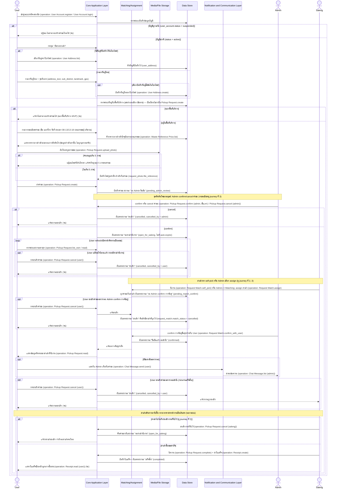

# Detailed Design: User — สร้างและติดตามคำขอเรียกรถซาเล้ง (Pickup Request)

> เอกสารนี้ขยาย sequence diagram ระดับ high-level ของ journey นี้ (ดู [[../../01-prototypes/20260820-001-user-pickup-request-journey|User — สร้างและติดตามคำขอเรียกรถซาเล้ง (Pickup Request) Journey]] และ [[../high-level-architecture|high-level-architecture]] หัวข้อ "1. User — สร้างและติดตามคำขอเรียกรถซาเล้ง") ให้ละเอียดขึ้นเป็นระดับ interaction spec เชิงแนวคิด (conceptual) เท่านั้น **ไม่ผูกมัดกับ technology stack ใดๆ** การเลือก stack จริงจะอยู่ในเอกสารแยกต่างหากเมื่อถึงขั้นตอนออกแบบเชิงเทคนิคถัดไป

## ภาพรวม

Journey นี้ครอบคลุมทั้งวงจรชีวิตของคำขอเรียกรถซาเล้งฝั่ง User ตั้งแต่เลือก/กรอกที่อยู่ กรอกรายละเอียดคำขอ อัปโหลดรูป ส่งคำขอ ผ่านการ confirm ของ Admin สองจุด (confirm/cancel คำขอครั้งแรก และ confirm การจับคู่ขั้นสุดท้าย) จนถึงเห็นใบเสร็จเมื่องานเสร็จสิ้น เอกสารนี้เพิ่มรายละเอียดที่ high-level-architecture ยังไม่ลงลึก ได้แก่ validation ของที่อยู่/จำนวนรูป, จุดที่ User สามารถยกเลิกคำขอได้หลายจุดตาม edge case ของ journey ต้นฉบับ, และเส้นทางที่สาเล้งยกเลิกงานที่รับไว้แล้วทำให้คำขอย้อนกลับสถานะ — ทุก message ที่เป็นการเรียกดำเนินการผูกกับ operation จริงจาก [[../api-spec|api-spec]] แล้ว (โปรเจกต์นี้มี `api-spec.md`/`database-schema.md` ครอบคลุม journey นี้ครบ)

## Actors

- **User** — เจ้าของขยะ, actor หลักของ journey นี้
- **Admin** — ตัดสินใจ confirm/cancel คำขอ และ confirm การจับคู่ขั้นสุดท้าย (รายละเอียดเต็มดู [[20260820-003-admin-request-matching-detailed-design|Admin — Request Matching Detailed Design]])
- **Saleng** — ฝ่ายรับงานและปิดงาน (รายละเอียดเต็มดู [[20260820-002-saleng-job-fulfillment-detailed-design|Saleng — Job Fulfillment Detailed Design]])

## Pre-condition / Post-condition

- Pre-condition:
  - User มีบัญชีในระบบ (สมัครแล้ว หรือกำลังสมัครในขั้นตอนแรกของ flow) และ `user_account.status = active` (ไม่ใช่ `suspended`)
  - User มีขยะ recycle สะสมอยู่และต้องการสร้างคำขอ
- Post-condition (สำเร็จ): `pickup_request.status = completed` มีใบเสร็จ (`receipt` + `receipt_item`) ที่สาเล้งส่งเข้ามาให้ User เห็นเป็นหลักฐานการซื้อขาย
- Post-condition (ยกเลิก/ล้มเหลว): `pickup_request.status = cancelled` — เกิดได้จากหลายจุด (Admin cancel ตั้งแต่ต้น, User ยกเลิกเองระหว่างรอ) หรือกรณีสาเล้งยกเลิกงาน คำขอจะย้อนกลับไป `status = open_for_saleng` ไม่ใช่ `cancelled` — ดูตาราง state transition

## Sequence Diagram: สร้างและติดตามคำขอเรียกรถซาเล้ง

### สรุป Business Rule / Validation ต่อ step

| Step / จุดในผัง | เงื่อนไข/Validation | ผลลัพธ์ถ้าผ่าน | ผลลัพธ์ถ้าไม่ผ่าน | อ้างอิง spec / api-spec |
|---|---|---|---|---|
| ตรวจสอบสถานะบัญชีก่อนสร้างคำขอ | `user_account.status` ต้องเป็น `active` | ดำเนินการต่อได้ | ปฏิเสธการสร้างคำขอ (จบ) | spec Business rules: "บัญชีที่ถูกระงับจะไม่สามารถสร้างคำขอ...ได้อีก"; api-spec `User Account.suspend/unsuspend` |
| ตรวจสอบพื้นที่บริการ | ที่อยู่ (จากโปรไฟล์หรือกรอกใหม่) ต้องอยู่ในเขตอำเภอเมือง จังหวัดเชียงราย | อนุญาตให้กรอกรายละเอียดคำขอต่อ | แจ้งไม่สามารถสร้างคำขอได้ (จบ) | spec Business rules: "พื้นที่ให้บริการของ MVP จำกัดเฉพาะเขตอำเภอเมือง จังหวัดเชียงราย"; api-spec `Pickup Request.create` |
| อัปโหลดรูปถ่ายขยะ | จำนวนไฟล์รวมต้องไม่เกิน 5 ภาพต่อคำขอ | บันทึกไฟล์อ้างอิงกับคำขอ (`request_photo`) | ปฏิเสธไฟล์ส่วนเกิน แจ้งโควตา | spec Business rules: "จำนวนรูปถ่ายขยะที่อัปโหลดได้ต่อคำขอ จำกัดไม่เกิน 5 ภาพ"; database-schema `request_photo` constraint; api-spec `Pickup Request.upload_photo` |
| Admin confirm/cancel คำขอ | การตัดสินใจของมนุษย์ (Admin) | สถานะเปลี่ยนเป็น `open_for_saleng` | สถานะเปลี่ยนเป็น `cancelled` (จบ) | spec Business rules: "คำขอต้องผ่านการ confirm จาก Admin กับ user เป็นขั้นสุดท้ายเสมอ" (ขั้นแรก); api-spec `Pickup Request.confirm (admin, ขั้นแรก)` / `.cancel (admin)` |
| รอสาเล้งรับงาน | ไม่มี auto-expire — ค้างสถานะได้ไม่จำกัดเวลา จนกว่าจะถูกยกเลิกหรือมีคนรับ | คำขอยังคงแสดงในรายการของสาเล้งต่อไป | — | spec Business rules: "คำขอที่ยังไม่มีสาเล้งรับงานจะไม่มีการหมดอายุอัตโนมัติ" |
| User กดยกเลิกคำขอ (ทุกจุดก่อนเสร็จสิ้น) | คำขอยังไม่อยู่ในสถานะ `completed` | เปลี่ยนสถานะเป็น `cancelled` คืนสิทธิ์สาเล้งที่ผูกไว้ (ถ้ามี) | — | spec Business rules: "User หรือ saleng สามารถยกเลิกคำขอได้ก่อนงานเสร็จสิ้น"; journey edge case "ยกเลิกได้หลายจุด"; api-spec `Pickup Request.cancel (user)` |
| สาเล้งยกเลิกงานที่รับไว้ | เกิดจากฝั่งสาเล้ง (ดู journey ที่ 2) ไม่ใช่ User | คำขอย้อนกลับสถานะ `open_for_saleng` (ไม่ใช่ `cancelled`) | — | journey edge case "สาเล้งเป็นฝ่ายยกเลิก"; api-spec `Pickup Request.cancel (saleng)` |
| Admin confirm การจับคู่ขั้นสุดท้าย | การตัดสินใจของมนุษย์ (Admin) หลังมีสาเล้งรับงานแล้ว | สถานะเปลี่ยนเป็น `confirmed` งานเริ่มอย่างเป็นทางการ | คำขอค้างสถานะ `pending_match_confirm` ต่อไป | spec Business rules: "คำขอต้องผ่านการ confirm จาก Admin กับ user เป็นขั้นสุดท้ายเสมอ" (ขั้นสุดท้าย); api-spec `Request Match.confirm_with_user` |
| สาเล้งปิดงาน + ส่งใบเสร็จ | ต้องเกิดหลังสถานะ `confirmed` เท่านั้น (`Receipt.create` ต้องการ `request_id` ที่ `status = completed`) | สถานะเปลี่ยนเป็น `completed` ใบเสร็จปรากฏฝั่ง User | — | spec Business rules: "โครงสร้างใบเสร็จ...ต้องปรากฏทั้งฝั่ง user และฝั่ง Admin"; api-spec `Pickup Request.complete` / `Receipt.create` |

## การเปลี่ยนสถานะที่เกี่ยวข้อง

| จากสถานะ | เป็นสถานะ | จุดในผัง |
|---|---|---|
| (ยังไม่มีคำขอ) | pending_admin_review | User กดส่งคำขอสำเร็จ (`Pickup Request.create`) |
| pending_admin_review | cancelled | Admin กด cancel |
| pending_admin_review | open_for_saleng | Admin กด confirm |
| open_for_saleng | cancelled | User กดยกเลิกคำขอระหว่างรอ |
| open_for_saleng | pending_match_confirm | สาเล้ง self-pick หรือ Admin assign สำเร็จ |
| pending_match_confirm | cancelled | User กดยกเลิกคำขอระหว่างรอ Admin confirm |
| pending_match_confirm | confirmed | Admin confirm การจับคู่ขั้นสุดท้าย |
| confirmed | cancelled | User กดยกเลิกคำขอระหว่างรอเข้ารับ |
| confirmed | open_for_saleng | สาเล้งยกเลิกงานที่รับไว้ (ไปไม่ถึง/User ไม่อยู่บ้าน) |
| confirmed | completed | สาเล้งปิดงาน + ส่งใบเสร็จสำเร็จ |

## สมมติฐานและข้อจำกัด

- Diagram นี้ขยายจาก sequence diagram journey ที่ 1 ใน [[../high-level-architecture|high-level-architecture]] โดยเพิ่ม validation (พื้นที่บริการ, จำนวนรูป, สถานะบัญชีถูกระงับ) และจุดยกเลิกหลายจุดตาม "เส้นทางอื่น / Edge case" ของ journey doc ต้นฉบับ — ทุก step สืบย้อนกลับไปหา node จริงใน journey doc หรือ business rule ของ spec ได้ครบ ไม่มีการเดา step ใหม่ที่ไม่มีต้นทางรองรับ
- โปรเจกต์นี้มี [[../api-spec|api-spec]] และ [[../database-schema|database-schema]] ครบแล้วครอบคลุม journey นี้ทั้งหมด ทุก message ที่เป็นการเรียกดำเนินการจึงผูกกับ operation จริง (ระบุกำกับด้วย `(operation: ...)` ในไดอะแกรม) ไม่ต้องใช้ business logic step แทนอีกต่อไป
- ชื่อ component ทั้งหมดอ้างอิงตรงจาก [[../high-level-architecture|high-level-architecture]] ไม่มีการตั้งชื่อใหม่

## คำถามเปิด / จุดที่ต้องตัดสินใจเพิ่มเติม

- ผลกระทบต่อคำขอที่ค้างอยู่ (ทุกสถานะก่อน `completed`) เมื่อบัญชี User ถูกระงับระหว่างทาง — ยังไม่มีคำตอบจากสเปก (ดู [[../high-level-architecture|high-level-architecture]] คำถามเปิดข้อ 3 และ [[../database-schema|database-schema]] คำถามเปิดข้อ 2) เอกสารนี้จึงยังไม่ได้วาดเป็น flow ในไดอะแกรม รอการยืนยันจาก user ก่อนเพิ่ม

## Reference

- [[../../01-prototypes/20260820-001-user-pickup-request-journey|User — สร้างและติดตามคำขอเรียกรถซาเล้ง (Pickup Request) Journey]]
- [[../../../01-requirements/01-spec/20260819-001-saleng-pickup-request|Call-Saleng: ระบบเรียกรถซาเล้งมารับซื้อขยะ Recycle ที่บ้าน]]
- [[../high-level-architecture|high-level-architecture]]
- [[../api-spec|api-spec]]
- [[../database-schema|database-schema]]
- [[20260820-002-saleng-job-fulfillment-detailed-design|Saleng — Job Fulfillment Detailed Design]]
- [[20260820-003-admin-request-matching-detailed-design|Admin — Request Matching Detailed Design]]
- [[index|detailed-design]]
