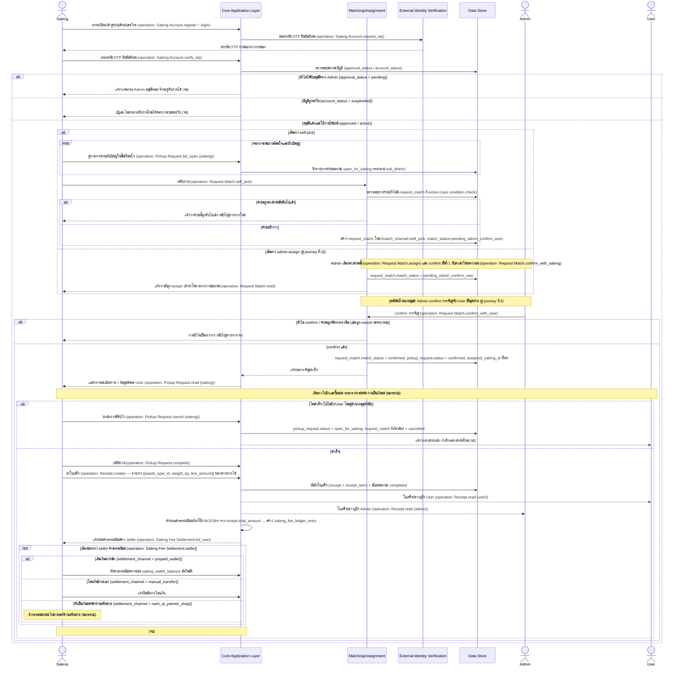

# Detailed Design: Saleng — รับงานและปิดงาน (Job Fulfillment)

> เอกสารนี้ขยาย sequence diagram ระดับ high-level ของ journey นี้ (ดู [[../../01-prototypes/20260820-002-saleng-job-fulfillment-journey|Saleng — รับงานและปิดงาน (Job Fulfillment) Journey]] และ [[../high-level-architecture|high-level-architecture]] หัวข้อ "2. Saleng — รับงานและปิดงาน") ให้ละเอียดขึ้นเป็นระดับ interaction spec เชิงแนวคิด (conceptual) เท่านั้น **ไม่ผูกมัดกับ technology stack ใดๆ** การเลือก stack จริงจะอยู่ในเอกสารแยกต่างหากเมื่อถึงขั้นตอนออกแบบเชิงเทคนิคถัดไป

## ภาพรวม

Journey นี้ครอบคลุมฝั่งสาเล้งตั้งแต่ลงทะเบียน/เข้าสู่ระบบด้วยเบอร์โทร/OTP ตรวจสอบสิทธิ์การอนุมัติ ดูรายการงาน/self-pick หรือรับงานที่ Admin assign ให้ รอ Admin confirm ขั้นสุดท้าย ไปจนถึงปิดงาน ส่งใบเสร็จ และเห็นยอดค่าธรรมเนียมที่ต้อง settle เอกสารนี้เพิ่มรายละเอียด race-condition check ตอน self-pick, เส้นทาง admin-assign แบบเต็ม (ไม่ใช่แค่ note), และ 3 ช่องทาง settle ค่าธรรมเนียมตาม business model ของสเปก — ทุก message ที่เป็นการเรียกดำเนินการผูกกับ operation จริงจาก [[../api-spec|api-spec]] แล้ว

## Actors

- **Saleng** — actor หลักของ journey นี้
- **Admin** — ผู้ confirm การจับคู่ขั้นสุดท้ายเสมอ ไม่ว่าจะมาจาก self-pick หรือ admin-assign (รายละเอียดเต็มดู [[20260820-003-admin-request-matching-detailed-design|Admin — Request Matching Detailed Design]])
- **User** — เจ้าของขยะที่สาเล้งไปรับซื้อ (รายละเอียดเต็มดู [[20260820-001-user-pickup-request-detailed-design|User — Pickup Request Detailed Design]])

## Pre-condition / Post-condition

- Pre-condition:
  - Saleng ลงทะเบียนในระบบแล้ว (`saleng_account` มีอยู่ อาจยังไม่ผ่านการอนุมัติจาก Admin)
  - มีคำขออย่างน้อย 1 รายการอยู่ในสถานะ `open_for_saleng` ในพื้นที่ที่สาเล้งสนใจ (สำหรับเส้นทาง self-pick) หรือ Admin ได้เรียก `Request Match.assign` ให้สาเล้งคนนี้แล้ว (สำหรับเส้นทาง admin-assign)
- Post-condition (สำเร็จ): `pickup_request.status = completed` ใบเสร็จ (`receipt`) ถูกบันทึกและปรากฏทั้งฝั่ง User/Admin ค่าธรรมเนียม 20 บาทถูกคำนวณเป็น `saleng_fee_ledger_entry` และรอ/อยู่ระหว่าง settle
- Post-condition (ยกเลิก/ล้มเหลว): งานที่รับไว้ถูกยกเลิกโดยสาเล้ง คำขอย้อนกลับสถานะ `open_for_saleng` ให้สาเล้งคนอื่นรับต่อได้ หรือสาเล้งไม่ผ่านการอนุมัติ/ถูกระงับจึงไม่สามารถดู/รับงานได้เลย

## Sequence Diagram: รับงานและปิดงาน

### สรุป Business Rule / Validation ต่อ step

| Step / จุดในผัง | เงื่อนไข/Validation | ผลลัพธ์ถ้าผ่าน | ผลลัพธ์ถ้าไม่ผ่าน | อ้างอิง spec / api-spec |
|---|---|---|---|---|
| ตรวจสอบสถานะบัญชีหลัง OTP | `approval_status = approved` และ `account_status ≠ suspended` | เข้าดู/รับงานได้ | แจ้งรออนุมัติ หรือปฏิเสธถ้าถูกระงับ (จบ) | spec Business rules: "สาเล้งต้องลงทะเบียนและได้รับการอนุมัติจาก Admin ก่อนจึงจะเห็นและรับงานได้"; "บัญชีที่ถูกระงับจะไม่สามารถ...รับงานใหม่ได้อีก"; database-schema `saleng_account.approval_status` / `account_status` |
| กดรับงาน (self-pick) | คำขอนั้นต้องยังไม่มี `request_match` ที่ `match_status` อยู่ในกลุ่ม active (race condition) | สร้าง `request_match` ใหม่ สถานะ `pending_admin_confirm_user` | แจ้งว่าคำขอถูกรับไปแล้ว กลับไปดูรายการใหม่ | spec Business rules: "คำขอ 1 รายการต้องผูกกับสาเล้งได้เพียง 1 คนเท่านั้น...ต้องหายไปจากรายการ...ทันทีที่มีคนรับงานแล้ว"; api-spec `Request Match.self_pick`; database-schema `request_match` constraint |
| Admin confirm การจับคู่ขั้นสุดท้าย | การตัดสินใจของมนุษย์ (Admin) — ทั้งเส้นทาง self-pick และ admin-assign ต้องผ่านจุดนี้เหมือนกัน | งานเป็นของสาเล้งคนนี้อย่างเป็นทางการ สถานะ `confirmed` | สาเล้งยังไม่เห็นรายละเอียดงาน/ข้อมูลติดต่อ User | spec Business rules: "คำขอต้องผ่านการ confirm จาก Admin กับ user เป็นขั้นสุดท้ายเสมอ ไม่ว่าจะจับคู่ด้วยวิธีใด"; api-spec `Request Match.confirm_with_user` |
| สาเล้งยกเลิกงานที่รับไว้ | เกิดได้ก่อนงานเสร็จสิ้นเท่านั้น (ก่อน `status = completed`) | คำขอย้อนกลับสถานะ `open_for_saleng` เปิดให้สาเล้งคนอื่นรับต่อ | — | spec Business rules: "User หรือ saleng สามารถยกเลิกคำขอได้ก่อนงานเสร็จสิ้น"; api-spec `Pickup Request.cancel (saleng)` |
| ส่งใบเสร็จหลังปิดงาน | ต้องเรียกหลัง `Pickup Request.complete` แล้วเท่านั้น (`request_id` ต้อง `status = completed`) ใบเสร็จมีได้หลายรายการ (ประเภทขยะ/น้ำหนัก/ราคา) ต่อ 1 ใบ | บันทึกใบเสร็จ ปรากฏฝั่ง User และ Admin | — | spec Business rules: "โครงสร้างใบเสร็จ...ประกอบด้วยรายการ...โดยมีได้หลายรายการต่อ 1 ใบเสร็จ"; api-spec `Receipt.create` |
| คำนวณค่าธรรมเนียม | คิด 20 บาทต่อคำขอที่ขายสำเร็จ จาก `receipt.total_amount` หักจากเงินที่ User ได้รับจริง (`user_received_amount`) | สร้าง `saleng_fee_ledger_entry` แจ้งยอดค้าง settle ให้สาเล้ง 1 ใน 3 ช่องทาง | — | spec Business Model: "ค่าธรรมเนียมเรียกใช้งาน...20 บาท...หักออกจากเงินที่ user ได้รับจริง ไม่ใช่หักเพิ่มจากสาเล้ง"; api-spec `Receipt.create` effect / `Saleng Fee Settlement.settle` |

## การเปลี่ยนสถานะที่เกี่ยวข้อง

| จากสถานะ | เป็นสถานะ | จุดในผัง |
|---|---|---|
| open_for_saleng | pending_match_confirm (request_match: pending_admin_confirm_user) | สาเล้งกด self-pick สำเร็จ (คำขอยังว่าง) |
| open_for_saleng | pending_match_confirm (request_match: pending_admin_confirm_user หลัง confirm_with_saleng) | Admin เลือก assign + confirm ขั้นที่ 1 กับสาเล้ง |
| pending_match_confirm | confirmed | Admin confirm การจับคู่ขั้นสุดท้ายกับ User |
| confirmed | open_for_saleng | สาเล้งยกเลิกงานที่รับไว้ (ไม่สำเร็จ) |
| confirmed | completed | สาเล้งปิดงาน + ส่งใบเสร็จสำเร็จ |
| (ใบเสร็จสร้างใหม่) | saleng_fee_ledger_entry.settlement_status: pending → settled | สาเล้งเลือกช่องทาง settle ค่าธรรมเนียม |

## สมมติฐานและข้อจำกัด

- Diagram นี้ขยายจาก sequence diagram journey ที่ 2 ใน [[../high-level-architecture|high-level-architecture]] โดยเปลี่ยนเส้นทาง admin-assign จาก note บรรยาย (ในเอกสารต้นทาง) ให้เป็น `alt` block เต็มรูปแบบเทียบเคียงกับ self-pick เพื่อให้เห็น interaction ชัดเจนขึ้น และเพิ่ม 3 ช่องทาง settle ค่าธรรมเนียมเป็น `alt` ย่อยตาม Business Model ของสเปก
- โปรเจกต์นี้มี [[../api-spec|api-spec]] และ [[../database-schema|database-schema]] ครบแล้วครอบคลุม journey นี้ทั้งหมด ทุก message ที่เป็นการเรียกดำเนินการจึงผูกกับ operation จริง (ระบุกำกับด้วย `(operation: ...)`)
- ขั้นตอน OTP ในไดอะแกรมแสดงเฉพาะเส้นทางสำเร็จ (ขอรหัส → ได้รับรหัส → กรอกรหัส) ตามที่ journey doc ต้นฉบับและ api-spec (`request_otp` → `verify_otp`) ระบุไว้เพียงเท่านี้ ไม่ได้เพิ่ม error path ของ OTP (เช่น รหัสผิด/หมดอายุ) เพราะ journey doc/spec/api-spec ไม่ได้ระบุรายละเอียดนี้ไว้ — ไม่ใช่การเดา จึงไม่นำมาใส่ในไดอะแกรม
- `top_up_wallet` (การเติมเงินเข้า wallet ก่อนใช้ช่องทาง prepaid_wallet) ไม่ได้วาดเป็น step แยกในไดอะแกรมนี้ เพราะเป็น operation ที่เกิดขึ้นก่อนหน้า flow การปิดงาน (ไม่ผูกกับ journey นี้โดยตรง) — ดูรายละเอียดที่ [[../api-spec#Saleng Fee Settlement|api-spec]]

## คำถามเปิด / จุดที่ต้องตัดสินใจเพิ่มเติม

- กรณี Admin **ปฏิเสธจริง** การจับคู่ที่สาเล้งกด self-pick ไว้ (ไม่ใช่แค่ยังไม่ confirm) สิทธิ์ของสาเล้งคนนั้นควรเป็นอย่างไร — ยังไม่มีคำตอบจากสเปก (ดู [[../high-level-architecture|high-level-architecture]] คำถามเปิดข้อ 2 และ [[../api-spec|api-spec]] คำถามเปิดข้อ 1) ไดอะแกรมข้างต้นจึงครอบคลุมเฉพาะกรณี "ยังไม่ confirm" เท่านั้น ไม่ได้วาด `Request Match.reject` เพราะยังไม่มี business rule รองรับผลลัพธ์ที่ชัดเจน
- ผลกระทบต่องานที่ค้างอยู่เมื่อบัญชีสาเล้งถูกระงับระหว่างมีงานที่รับไว้แล้วยังไม่เสร็จสิ้น — ยังไม่มีคำตอบจากสเปก (ดู [[../high-level-architecture|high-level-architecture]] คำถามเปิดข้อ 3 และ [[../database-schema|database-schema]] คำถามเปิดข้อ 2)
- `top_up_wallet` ควรเป็น operation ที่ Saleng เรียกเอง, Admin เป็นผู้บันทึกแทน, หรือทั้งสองฝ่าย — ยังไม่มีคำตอบ (ดู [[../api-spec|api-spec]] คำถามเปิดข้อ 3)

## Reference

- [[../../01-prototypes/20260820-002-saleng-job-fulfillment-journey|Saleng — รับงานและปิดงาน (Job Fulfillment) Journey]]
- [[../../../01-requirements/01-spec/20260819-001-saleng-pickup-request|Call-Saleng: ระบบเรียกรถซาเล้งมารับซื้อขยะ Recycle ที่บ้าน]]
- [[../high-level-architecture|high-level-architecture]]
- [[../api-spec|api-spec]]
- [[../database-schema|database-schema]]
- [[20260820-001-user-pickup-request-detailed-design|User — Pickup Request Detailed Design]]
- [[20260820-003-admin-request-matching-detailed-design|Admin — Request Matching Detailed Design]]
- [[index|detailed-design]]
