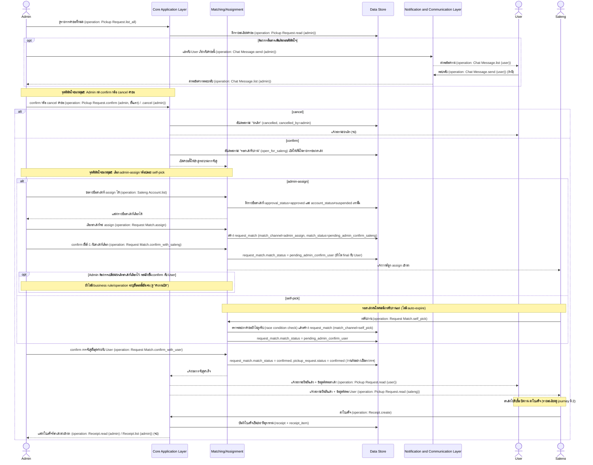

# Detailed Design: Admin — ตรวจสอบและจับคู่คำขอ (Request Matching)

> เอกสารนี้ขยาย sequence diagram ระดับ high-level ของ journey นี้ (ดู [[../../01-prototypes/20260820-003-admin-request-matching-journey|Admin — ตรวจสอบและจับคู่คำขอ (Request Matching) Journey]] และ [[../high-level-architecture|high-level-architecture]] หัวข้อ "3. Admin — ตรวจสอบและจับคู่คำขอ") ให้ละเอียดขึ้นเป็นระดับ interaction spec เชิงแนวคิด (conceptual) เท่านั้น **ไม่ผูกมัดกับ technology stack ใดๆ** การเลือก stack จริงจะอยู่ในเอกสารแยกต่างหากเมื่อถึงขั้นตอนออกแบบเชิงเทคนิคถัดไป

## ภาพรวม

Journey นี้คือจุดศูนย์กลางที่ Admin บังคับใช้ business rule เรื่องการจับคู่งานทั้งหมด: ตรวจสอบคำขอที่เข้ามา, confirm/cancel คำขอครั้งแรก, เลือกเส้นทางจับคู่ (self-pick หรือ admin-assign), และ confirm การจับคู่ขั้นสุดท้ายกับ User เสมอไม่ว่าจะมาจากเส้นทางใด เอกสารนี้ขยายรายละเอียดขั้นตอน admin-assign แบบ 2 ขั้น (confirm กับสาเล้งก่อน แล้ว confirm กับ User) ให้เห็นชัดเจน และระบุ note การกรองรายชื่อสาเล้งที่เลือก assign ได้ — ทุก message ที่เป็นการเรียกดำเนินการผูกกับ operation จริงจาก [[../api-spec|api-spec]] แล้ว

## Actors

- **Admin** — actor หลักของ journey นี้
- **User** — เจ้าของคำขอ (รายละเอียดเต็มดู [[20260820-001-user-pickup-request-detailed-design|User — Pickup Request Detailed Design]])
- **Saleng** — ฝ่ายรับงาน/ถูก assign งาน (รายละเอียดเต็มดู [[20260820-002-saleng-job-fulfillment-detailed-design|Saleng — Job Fulfillment Detailed Design]])

## Pre-condition / Post-condition

- Pre-condition: มีคำขอใหม่จาก User อยู่ในสถานะ `pending_admin_review` ที่ Admin ยังไม่ได้ตรวจสอบ
- Post-condition (สำเร็จ): `pickup_request.status = confirmed` งานเริ่มอย่างเป็นทางการ และภายหลัง Admin เห็นใบเสร็จ (`receipt`) ที่สาเล้งส่งเข้ามาเป็นประวัติธุรกรรม
- Post-condition (ยกเลิก): `pickup_request.status = cancelled` (จากการ cancel ตั้งแต่ต้น) — การระงับบัญชี User ที่ Admin ทำได้แยกต่างหากไม่ได้ผูกกับคำขอใดคำขอหนึ่งโดยเฉพาะ (ดู "สมมติฐานและข้อจำกัด")

## Sequence Diagram: ตรวจสอบและจับคู่คำขอ

### สรุป Business Rule / Validation ต่อ step

| Step / จุดในผัง | เงื่อนไข/Validation | ผลลัพธ์ถ้าผ่าน | ผลลัพธ์ถ้าไม่ผ่าน | อ้างอิง spec / api-spec |
|---|---|---|---|---|
| Admin confirm/cancel คำขอ | การตัดสินใจของมนุษย์ | สถานะเป็น `open_for_saleng` เปิดให้จับคู่ | สถานะเป็น `cancelled` (จบ) | spec Business rules: "Admin กด confirm หรือ cancel คำขอของ user แต่ละรายการ"; api-spec `Pickup Request.confirm (admin, ขั้นแรก)` / `.cancel (admin)` |
| เลือกสาเล้งที่จะ assign | รายชื่อสาเล้งที่เลือกได้ต้องกรองเฉพาะ `approval_status=approved` และ `account_status≠suspended` เท่านั้น | Admin เลือกได้เฉพาะสาเล้งที่ผ่านเกณฑ์ | สาเล้งที่ไม่ผ่านเกณฑ์ไม่ปรากฏในรายการให้เลือก | อนุมานจาก spec Business rules: "สาเล้งต้อง...ได้รับการอนุมัติจาก Admin ก่อนจึงจะเห็นและรับงานได้" และ "บัญชีที่ถูกระงับจะไม่สามารถ...รับงานใหม่ได้"; api-spec `Saleng Account.list` |
| Admin confirm ขั้นที่ 1 (เฉพาะเส้นทาง admin-assign) | ต้องเลือกสาเล้งไว้ก่อนแล้ว (`request_match.match_status = pending_admin_confirm_saleng`) | คำขอผูกกับสาเล้งคนนั้น สถานะ `pending_admin_confirm_user` | — | spec Business rules: "กรณี Admin เลือก assign สาเล้งเอง: มี 2 ขั้นตอน — (1) Admin confirm การจับคู่กับสาเล้งที่เลือกก่อน แล้ว (2) Admin confirm กับ user อีกครั้ง"; api-spec `Request Match.confirm_with_saleng` |
| สาเล้งกดรับงาน (เฉพาะเส้นทาง self-pick) | คำขอต้องยังไม่ถูกรับโดยสาเล้งคนอื่น (race condition) | ผูกคำขอกับสาเล้งคนนั้น สถานะ `pending_admin_confirm_user` | แจ้งสาเล้งว่าคำขอถูกรับไปแล้ว | spec Business rules: "คำขอ 1 รายการต้องผูกกับสาเล้งได้เพียง 1 คนเท่านั้น"; api-spec `Request Match.self_pick` |
| Admin confirm การจับคู่ขั้นสุดท้ายกับ User | ต้องมีการจับคู่ (self-pick หรือ admin-assign) เกิดขึ้นก่อนแล้วเท่านั้น | สถานะเป็น `confirmed` งานเริ่มอย่างเป็นทางการ แจ้งทั้ง User และ Saleng | คำขอค้างสถานะ `pending_admin_confirm_user` ต่อไป | spec Business rules: "คำขอต้องผ่านการ confirm จาก Admin กับ user เป็นขั้นสุดท้ายเสมอ ไม่ว่าจะจับคู่ด้วยวิธีใด"; api-spec `Request Match.confirm_with_user` |
| Admin ดูใบเสร็จ | ต้องเกิดหลังสาเล้งปิดงาน+ส่งใบเสร็จสำเร็จเท่านั้น | บันทึกเป็นประวัติธุรกรรมของ Admin | — | spec Business rules: "ใบเสร็จ...ต้องปรากฏทั้งฝั่ง user และฝั่ง Admin"; api-spec `Receipt.read (admin)` / `.list (admin)` |

## การเปลี่ยนสถานะที่เกี่ยวข้อง

| จากสถานะ | เป็นสถานะ | จุดในผัง |
|---|---|---|
| pending_admin_review | cancelled | Admin กด cancel |
| pending_admin_review | open_for_saleng | Admin กด confirm |
| open_for_saleng | pending_match_confirm (request_match: pending_admin_confirm_saleng → pending_admin_confirm_user) | Admin เลือก assign + confirm ขั้นที่ 1 กับสาเล้ง |
| open_for_saleng | pending_match_confirm (request_match: pending_admin_confirm_user) | สาเล้งกด self-pick สำเร็จ |
| pending_match_confirm (ทั้ง 2 เส้นทาง) | confirmed | Admin confirm การจับคู่ขั้นสุดท้ายกับ User |

## สมมติฐานและข้อจำกัด

- Diagram นี้ขยายจาก sequence diagram journey ที่ 3 ใน [[../high-level-architecture|high-level-architecture]] โดยเพิ่ม (1) การ "ดึงรายชื่อสาเล้งที่ assign ได้" พร้อมเงื่อนไขกรองบัญชีอนุมัติ/ไม่ระงับ ซึ่งอนุมานจาก business rule ที่มีอยู่แล้วของสเปก ไม่ใช่ step ใหม่ที่ไม่มีที่มา (2) การ round-trip ของแชทกับ User (3) การ race-condition check ฝั่ง self-pick ให้ตรงกับที่ระบุไว้ใน journey ที่ 2 และ Business rules
- โปรเจกต์นี้มี [[../api-spec|api-spec]] และ [[../database-schema|database-schema]] ครบแล้วครอบคลุม journey นี้ทั้งหมด ทุก message ที่เป็นการเรียกดำเนินการจึงผูกกับ operation จริง (ระบุกำกับด้วย `(operation: ...)`)
- การระงับ (suspend) บัญชี User ที่ Admin ทำได้ทุกเมื่อ (ตาม edge case ของ journey doc ต้นฉบับ "การระงับบัญชี user" — operation `User Account.suspend`) ไม่ได้ผูกกับคำขอใดคำขอหนึ่งโดยเฉพาะ จึงไม่ได้วาดเป็นส่วนหนึ่งของ sequence diagram หลักด้านบน (จะทำให้ diagram สับสนเพราะไม่ใช่ linear flow เดียวกัน) — ถือเป็น action แยกที่ Admin ทำได้จากหน้าจัดการคำขอ ไม่ผูกกับ diagram นี้โดยตรง

## คำถามเปิด / จุดที่ต้องตัดสินใจเพิ่มเติม

- เปลี่ยน/ยกเลิกสาเล้งที่ Admin เลือก assign ไปแล้ว ก่อนถึงขั้น confirm กับ User ควรทำอย่างไร — ยังไม่มีคำตอบจากสเปก และ api-spec ยังไม่มี operation รองรับกรณีนี้โดยตรง (ดู [[../high-level-architecture|high-level-architecture]] คำถามเปิดข้อ 1) ไดอะแกรมข้างต้นใส่ไว้เป็น `opt` block พร้อม note กำกับว่ายังไม่มี business rule/operation รองรับ ไม่ได้เดา flow ต่อ
- คำขอที่ไม่มีใคร self-pick ค้างนานเนื่องจากไม่มี auto-expire — เป็นเหตุผลที่ business rule ให้ Admin มีทางเลือก admin-assign ไว้ช่วยจัดการ (ไม่ใช่คำถามเปิด แต่เป็นบริบทที่ทำให้ต้องมี 2 เส้นทางร่วมกัน)

## Reference

- [[../../01-prototypes/20260820-003-admin-request-matching-journey|Admin — ตรวจสอบและจับคู่คำขอ (Request Matching) Journey]]
- [[../../../01-requirements/01-spec/20260819-001-saleng-pickup-request|Call-Saleng: ระบบเรียกรถซาเล้งมารับซื้อขยะ Recycle ที่บ้าน]]
- [[../high-level-architecture|high-level-architecture]]
- [[../api-spec|api-spec]]
- [[../database-schema|database-schema]]
- [[20260820-001-user-pickup-request-detailed-design|User — Pickup Request Detailed Design]]
- [[20260820-002-saleng-job-fulfillment-detailed-design|Saleng — Job Fulfillment Detailed Design]]
- [[20260820-004-admin-saleng-management-detailed-design|Admin — Saleng Account Management Detailed Design]]
- [[index|detailed-design]]
