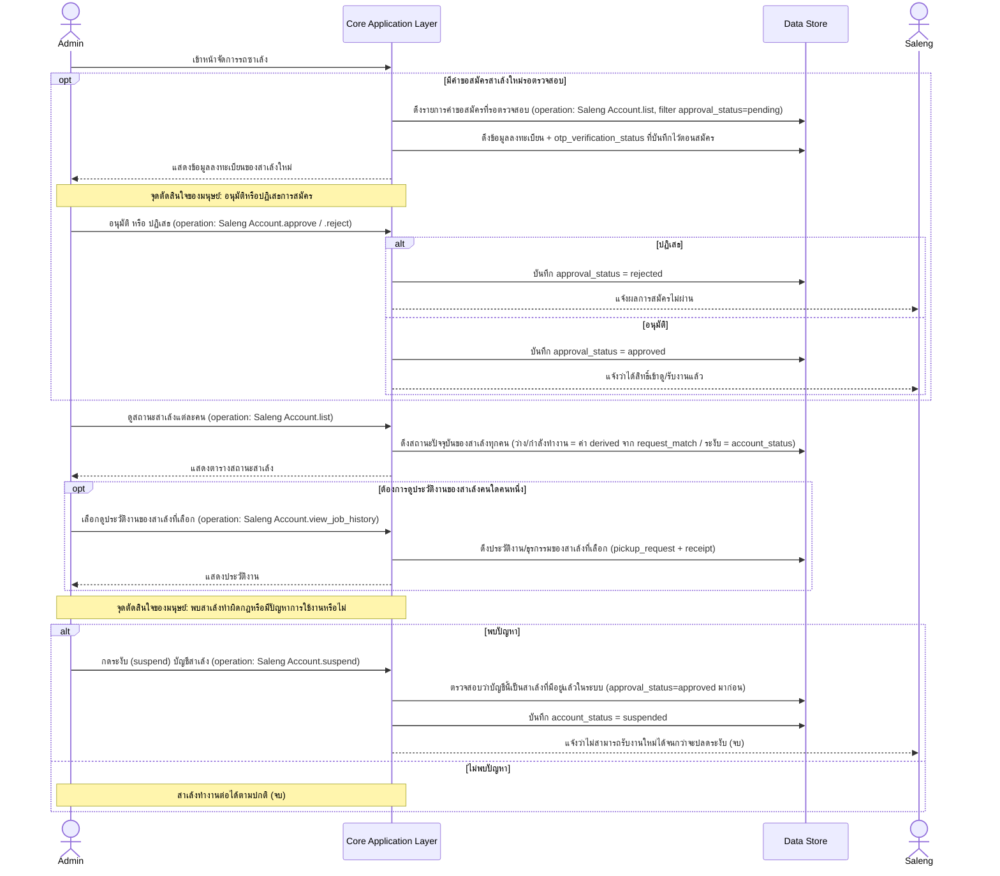

# Detailed Design: Admin — จัดการรถซาเล้ง (Saleng Account Management)

> เอกสารนี้ขยาย sequence diagram ระดับ high-level ของ journey นี้ (ดู [[../../01-prototypes/20260820-004-admin-saleng-management-journey|Admin — จัดการรถซาเล้ง (Saleng Account Management) Journey]] และ [[../high-level-architecture|high-level-architecture]] หัวข้อ "4. Admin — จัดการรถซาเล้ง") ให้ละเอียดขึ้นเป็นระดับ interaction spec เชิงแนวคิด (conceptual) เท่านั้น **ไม่ผูกมัดกับ technology stack ใดๆ** การเลือก stack จริงจะอยู่ในเอกสารแยกต่างหากเมื่อถึงขั้นตอนออกแบบเชิงเทคนิคถัดไป

## ภาพรวม

Journey นี้ครอบคลุม 4 ฟีเจอร์ของหน้าจัดการรถซาเล้งตามสเปก: อนุมัติ/ปฏิเสธการสมัครสาเล้งใหม่, ดูสถานะสาเล้งแต่ละคน, ดูประวัติงาน, และระงับ (suspend) บัญชี เอกสารนี้เพิ่มรายละเอียดว่าการอนุมัติอ้างอิงผลยืนยันตัวตนเบอร์โทร/OTP ที่บันทึกไว้ตั้งแต่ตอนสาเล้งลงทะเบียน (ไม่เรียก OTP service ซ้ำ) และทำให้ชัดว่าทั้ง 4 ฟีเจอร์อยู่ในหน้าเดียวกันแต่เป็นคนละ action ที่ Admin เลือกทำได้อิสระต่อกัน — ทุก message ที่เป็นการเรียกดำเนินการผูกกับ operation จริงจาก [[../api-spec|api-spec]] แล้ว

## Actors

- **Admin** — actor หลักของ journey นี้
- **Saleng** — ผู้สมัคร/บัญชีที่ถูกตรวจสอบ (รายละเอียดเต็มดู [[20260820-002-saleng-job-fulfillment-detailed-design|Saleng — Job Fulfillment Detailed Design]])

## Pre-condition / Post-condition

- Pre-condition: Admin เข้าสู่ระบบและเปิดหน้าจัดการรถซาเล้ง อาจมีหรือไม่มีคำขอสมัครสาเล้งใหม่ (`saleng_account.approval_status = pending`) ค้างอยู่ก็ได้
- Post-condition (สำเร็จ — อนุมัติสาเล้งใหม่): `saleng_account.approval_status = approved` เข้าดู/รับงานในระบบได้ (ดู [[20260820-002-saleng-job-fulfillment-detailed-design|Saleng — Job Fulfillment Detailed Design]])
- Post-condition (ปฏิเสธ): `saleng_account.approval_status = rejected` ไม่สามารถเข้าดู/รับงานได้
- Post-condition (ระงับบัญชี): `saleng_account.account_status = suspended` ไม่สามารถรับงานใหม่ได้จนกว่าจะปลดระงับ

## Sequence Diagram: จัดการรถซาเล้ง

### สรุป Business Rule / Validation ต่อ step

| Step / จุดในผัง | เงื่อนไข/Validation | ผลลัพธ์ถ้าผ่าน | ผลลัพธ์ถ้าไม่ผ่าน | อ้างอิง spec / api-spec |
|---|---|---|---|---|
| อนุมัติ/ปฏิเสธการสมัครสาเล้งใหม่ | อ้างอิงผลยืนยันตัวตนด้วยเบอร์โทร/OTP (`otp_verification_status`) เท่านั้น ไม่ต้องอัปโหลดเอกสารทะเบียนรถ/บัตรประชาชน | บัญชีเป็น `approved` เข้าดู/รับงานได้ | บัญชีเป็น `rejected` | spec Business rules: "การยืนยันตัวตนสาเล้งใน MVP ใช้เบอร์โทร/OTP เท่านั้น ไม่ต้องอัปโหลดเอกสารทะเบียนรถหรือบัตรประชาชน"; api-spec `Saleng Account.approve` / `.reject` |
| ระงับ (suspend) บัญชีสาเล้ง | ต้องเป็นบัญชีสาเล้งที่มีอยู่แล้วในระบบ (`approval_status = approved` มาก่อน) | บัญชีเป็น `suspended` ไม่สามารถรับงานใหม่ได้ | — | spec Business rules: "Admin สามารถระงับ (suspend) บัญชี user หรือ saleng ได้ทุกเมื่อที่พบการทำผิดกฎ...จนกว่าจะได้รับการปลดระงับ"; api-spec `Saleng Account.suspend` |

## การเปลี่ยนสถานะที่เกี่ยวข้อง

| จากสถานะ | เป็นสถานะ | จุดในผัง |
|---|---|---|
| approval_status: pending | rejected | Admin ปฏิเสธการสมัคร |
| approval_status: pending | approved | Admin อนุมัติการสมัคร |
| account_status: active | suspended | Admin กดระงับบัญชี |

## สมมติฐานและข้อจำกัด

- Diagram นี้ขยายจาก sequence diagram journey ที่ 4 ใน [[../high-level-architecture|high-level-architecture]] โดยแยก "ดึงรายการคำขอสมัครที่รอตรวจสอบ" ออกจาก "ดึงข้อมูลลงทะเบียน" ให้ชัดเจนขึ้น และเพิ่ม validation ว่าการระงับต้องเป็นบัญชีที่มีอยู่แล้ว (อนุมานจาก business rule ที่มีอยู่ ไม่ใช่ step ใหม่)
- โปรเจกต์นี้มี [[../api-spec|api-spec]] และ [[../database-schema|database-schema]] ครบแล้วครอบคลุม journey นี้ทั้งหมด ทุก message ที่เป็นการเรียกดำเนินการจึงผูกกับ operation จริง (ระบุกำกับด้วย `(operation: ...)`)
- ทั้ง 4 ฟีเจอร์ (อนุมัติ/ดูสถานะ/ดูประวัติ/ระงับ) แสดงในไดอะแกรมเดียวเป็นลำดับต่อเนื่องเพื่อให้เห็นภาพรวมของหน้าจัดการรถซาเล้ง แต่ในทางปฏิบัติ Admin สามารถเลือกทำ action ใดก่อนหลังก็ได้ ไม่จำเป็นต้องเรียงตามลำดับที่วาดไว้เป๊ะ (สอดคล้องกับคำอธิบายของ journey doc ต้นฉบับที่ระบุว่า "ไม่ว่าจะมีคำขอสมัครใหม่หรือไม่ Admin ยังดูสถานะ...และดูประวัติงาน...")

## คำถามเปิด / จุดที่ต้องตัดสินใจเพิ่มเติม

- ขั้นตอน/เงื่อนไขการปลดระงับ (unsuspend) บัญชีสาเล้ง — สเปกระบุว่าบัญชีที่ถูกระงับจะกลับมารับงานได้ "จนกว่าจะได้รับการปลดระงับ" แต่ไม่ได้อธิบายรายละเอียดขั้นตอนไว้ ยังไม่มีคำตอบ (ดู [[../high-level-architecture|high-level-architecture]] คำถามเปิดข้อ 4 และ [[../api-spec|api-spec]] คำถามเปิดข้อ 2 — api-spec มี operation `unsuspend` ที่อนุมานไว้แล้วแต่ยังไม่มีเงื่อนไขกำกับ) — ไดอะแกรมข้างต้นจึงยังไม่มี flow การปลดระงับ
- ผลกระทบต่องานที่ค้างอยู่เมื่อสาเล้งถูกระงับขณะมีงานที่รับไว้แล้วยังไม่เสร็จสิ้น — ยังไม่มีคำตอบจากสเปก (ดู [[../high-level-architecture|high-level-architecture]] คำถามเปิดข้อ 3 และ [[../database-schema|database-schema]] คำถามเปิดข้อ 2)

## Reference

- [[../../01-prototypes/20260820-004-admin-saleng-management-journey|Admin — จัดการรถซาเล้ง (Saleng Account Management) Journey]]
- [[../../../01-requirements/01-spec/20260819-001-saleng-pickup-request|Call-Saleng: ระบบเรียกรถซาเล้งมารับซื้อขยะ Recycle ที่บ้าน]]
- [[../high-level-architecture|high-level-architecture]]
- [[../api-spec|api-spec]]
- [[../database-schema|database-schema]]
- [[20260820-002-saleng-job-fulfillment-detailed-design|Saleng — Job Fulfillment Detailed Design]]
- [[20260820-003-admin-request-matching-detailed-design|Admin — Request Matching Detailed Design]]
- [[index|detailed-design]]
