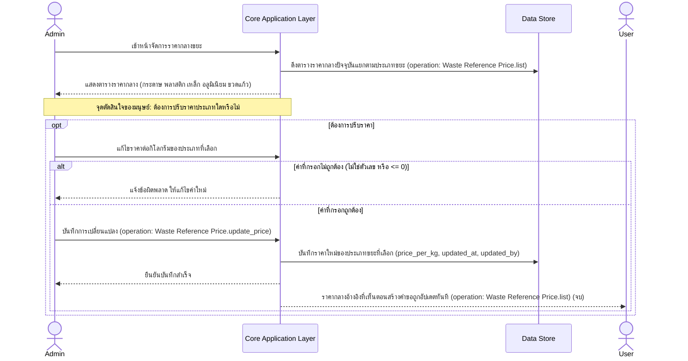

# Detailed Design: Admin — อัปเดตราคากลางขยะ (Price Management)

> เอกสารนี้ขยาย sequence diagram ระดับ high-level ของ journey นี้ (ดู [[../../01-prototypes/20260820-005-admin-price-management-journey|Admin — อัปเดตราคากลางขยะ (Price Management) Journey]] และ [[../high-level-architecture|high-level-architecture]] หัวข้อ "5. Admin — อัปเดตราคากลางขยะ") ให้ละเอียดขึ้นเป็นระดับ interaction spec เชิงแนวคิด (conceptual) เท่านั้น **ไม่ผูกมัดกับ technology stack ใดๆ** การเลือก stack จริงจะอยู่ในเอกสารแยกต่างหากเมื่อถึงขั้นตอนออกแบบเชิงเทคนิคถัดไป

## ภาพรวม

Journey นี้เป็นฟังก์ชันบริหารข้อมูลอ้างอิง (reference data) ล้วนๆ ไม่ผูกกับ lifecycle ของคำขอโดยตรง — Admin ดูตารางราคากลางปัจจุบันแยกตามประเภทขยะ แก้ไขราคาต่อกิโลกรัม แล้วบันทึก ระบบอัปเดตราคาที่ User เห็นตอนสร้างคำขอทันที เอกสารนี้เพิ่มเฉพาะ validation พื้นฐานของค่าที่กรอก (ราคาต้องเป็นตัวเลขและมากกว่า 0) ซึ่งเป็นสามัญสำนึกของข้อมูลประเภทราคาต่อหน่วย ไม่ได้มาจาก business rule ที่สเปกระบุไว้ตรงๆ — ทำเครื่องหมายไว้ชัดเจนใน "สมมติฐานและข้อจำกัด" เพื่อไม่ให้ปนกับ business rule จริง — ทุก message ที่เป็นการเรียกดำเนินการผูกกับ operation จริงจาก [[../api-spec|api-spec]] แล้ว

## Actors

- **Admin** — actor หลักของ journey นี้ เป็นผู้เดียวที่ตั้ง/อัปเดตราคากลางได้
- **User** — ผู้เห็นผลลัพธ์ของการอัปเดตราคาตอนสร้างคำขอ (รายละเอียดเต็มดู [[20260820-001-user-pickup-request-detailed-design|User — Pickup Request Detailed Design]])

## Pre-condition / Post-condition

- Pre-condition: Admin เข้าสู่ระบบและเปิดหน้าจัดการราคากลางขยะ มีตาราง `waste_reference_price` ปัจจุบันอยู่แล้ว (อย่างน้อยมีค่าเริ่มต้นตั้งไว้ต่อ `waste_type`)
- Post-condition (สำเร็จ — ปรับราคา): `waste_reference_price.price_per_kg` ของประเภทขยะที่เลือกถูกอัปเดต และ User เห็นราคาใหม่ทันทีตอนสร้างคำขอครั้งถัดไป
- Post-condition (ไม่ปรับราคา): ตารางราคากลางไม่เปลี่ยนแปลง จบ journey ทันที

## Sequence Diagram: อัปเดตราคากลางขยะ

### สรุป Business Rule / Validation ต่อ step

| Step / จุดในผัง | เงื่อนไข/Validation | ผลลัพธ์ถ้าผ่าน | ผลลัพธ์ถ้าไม่ผ่าน | อ้างอิง spec / api-spec |
|---|---|---|---|---|
| ผู้ที่แก้ไขราคากลางได้ | ต้องเป็น Admin เท่านั้น | อนุญาตให้เข้าหน้านี้และแก้ไขได้ | (ไม่มี actor อื่นเข้าถึงหน้านี้ตาม journey doc) | spec Business rules: "ราคากลางอ้างอิงต่อกิโลกรัมของขยะแต่ละประเภทตั้ง/อัปเดตได้โดย Admin เท่านั้น"; api-spec `Waste Reference Price.update_price` (Actor = Admin เท่านั้น) |
| แก้ไขราคาต่อกิโลกรัม | ค่าที่กรอกต้องเป็นตัวเลขและมากกว่า 0 (สมมติฐานสามัญสำนึก ไม่ใช่ business rule ที่สเปกระบุตรงๆ) | บันทึกราคาใหม่ | แจ้งข้อผิดพลาด ให้แก้ไขค่าใหม่ | ไม่มีในสเปก/api-spec โดยตรง — ดู "สมมติฐานและข้อจำกัด" |
| ราคากลางเป็นข้อมูลอ้างอิงเท่านั้น | ไม่ผูกกับธุรกรรมจริง ไม่มีผลย้อนหลังกับคำขอเก่า (คำขอไม่เก็บ snapshot ราคา) | User เห็นราคาประกอบการตัดสินใจ แต่ราคาซื้อขายจริงตกลงหน้างานแยกต่างหาก | — | spec Business rules: "ราคากลางอ้างอิง...เป็นเพียงข้อมูลอ้างอิงให้ user ประกอบการตัดสินใจ ไม่ใช่ราคาที่ผูกมัดกับธุรกรรมจริง"; database-schema `pickup_request` ไม่มี field เก็บราคาอ้างอิง |

## การเปลี่ยนสถานะที่เกี่ยวข้อง

journey นี้เป็นการบริหารข้อมูลอ้างอิง (reference data) ไม่มี entity ที่มีวงจรสถานะ (state lifecycle) เกี่ยวข้องโดยตรง — จึงไม่มีตารางการเปลี่ยนสถานะสำหรับ journey นี้

## สมมติฐานและข้อจำกัด

- Diagram นี้ขยายจาก sequence diagram journey ที่ 5 ใน [[../high-level-architecture|high-level-architecture]] โดยเพิ่ม validation ค่าที่กรอก (ตัวเลข, มากกว่า 0) ซึ่ง **ไม่ได้มาจาก business rule ที่สเปกระบุไว้ตรงๆ** แต่เป็นสามัญสำนึกทั่วไปของข้อมูลประเภทราคาต่อหน่วย ผู้ใช้ควรพิจารณายืนยัน/ปรับแก้ validation นี้อีกครั้งตอนออกแบบเชิงเทคนิคจริง
- โปรเจกต์นี้มี [[../api-spec|api-spec]] และ [[../database-schema|database-schema]] ครบแล้วครอบคลุม journey นี้ทั้งหมด ทุก message ที่เป็นการเรียกดำเนินการจึงผูกกับ operation จริง (ระบุกำกับด้วย `(operation: ...)`) — database-schema ยืนยันว่า `waste_reference_price` ไม่มี audit trail แบบตารางประวัติแยก และ `pickup_request` ไม่เก็บ snapshot ราคา จึงตอบคำถาม "ผลย้อนหลัง" บางส่วนแล้วว่าไม่มีกลไกเก็บย้อนหลังในโครงสร้างข้อมูลปัจจุบัน (แต่ยังไม่ใช่การยืนยันจาก user ว่านี่คือพฤติกรรมที่ต้องการ — ดู "คำถามเปิด")

## คำถามเปิด / จุดที่ต้องตัดสินใจเพิ่มเติม

- การเปลี่ยนราคากลางมีผลย้อนหลังกับคำขอที่ User สร้างไว้ก่อนหน้าหรือไม่ (เช่น คำขอที่ยัง `open_for_saleng` อยู่ควรแสดงราคา ณ ตอนสร้างคำขอ หรือราคาล่าสุดเสมอ) — database-schema ออกแบบไว้แบบไม่มี snapshot ราคาในคำขอ (จึงเท่ากับ "ราคาล่าสุดเสมอ" โดยปริยาย) แต่ยังไม่ได้รับการยืนยันจาก user ว่าเป็นพฤติกรรมที่ต้องการจริง (ดู [[../high-level-architecture|high-level-architecture]] คำถามเปิดข้อ 5 และ [[../database-schema|database-schema]] คำถามเปิดข้อ 5)
- ควรมี audit trail (ประวัติ) การเปลี่ยนราคาแต่ละครั้งหรือไม่ — ปัจจุบัน database-schema ออกแบบไว้แบบไม่มี ยังไม่มีคำตอบยืนยันจาก user (ดู [[../high-level-architecture|high-level-architecture]] คำถามเปิดข้อ 5 และ [[../database-schema|database-schema]] คำถามเปิดข้อ 5)

## Reference

- [[../../01-prototypes/20260820-005-admin-price-management-journey|Admin — อัปเดตราคากลางขยะ (Price Management) Journey]]
- [[../../../01-requirements/01-spec/20260819-001-saleng-pickup-request|Call-Saleng: ระบบเรียกรถซาเล้งมารับซื้อขยะ Recycle ที่บ้าน]]
- [[../high-level-architecture|high-level-architecture]]
- [[../api-spec|api-spec]]
- [[../database-schema|database-schema]]
- [[20260820-001-user-pickup-request-detailed-design|User — Pickup Request Detailed Design]]
- [[index|detailed-design]]
