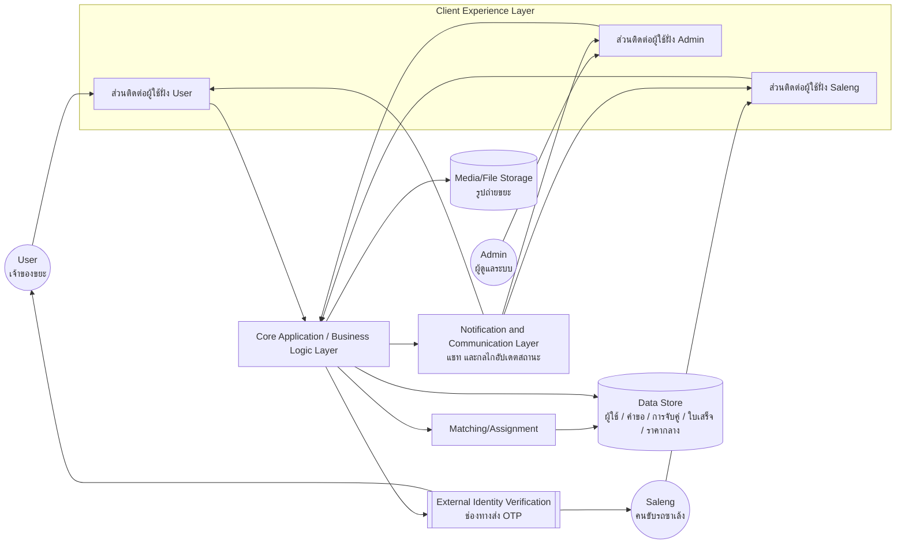
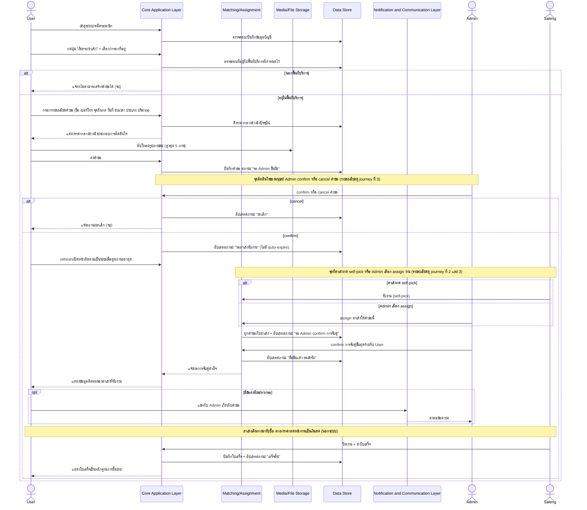
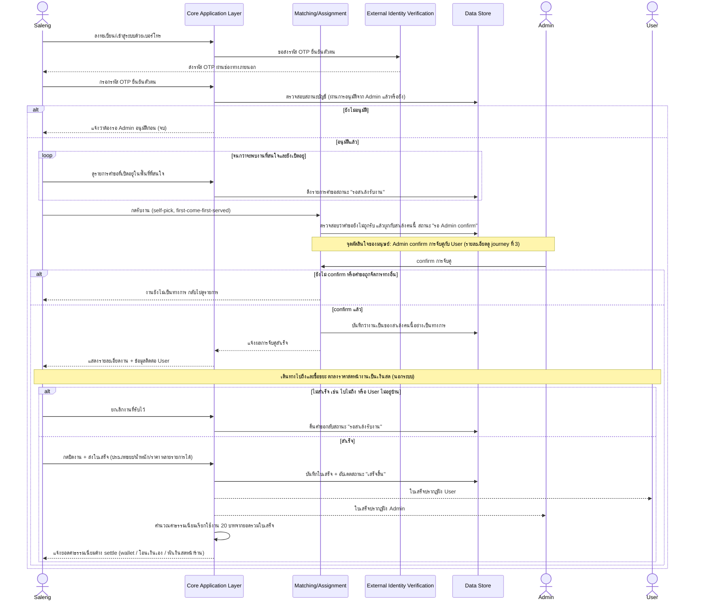
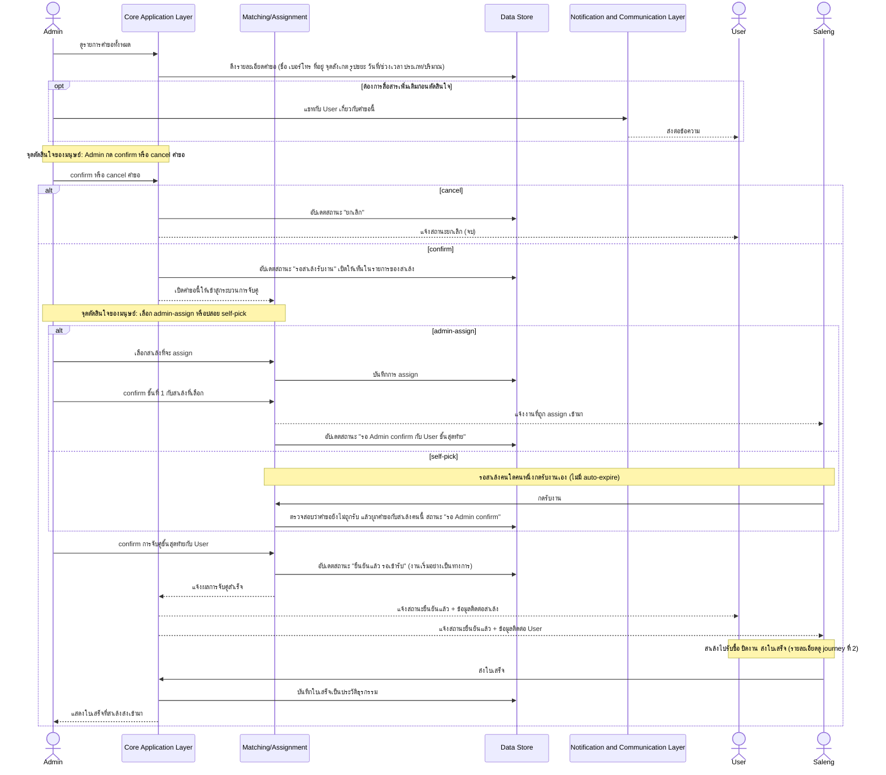
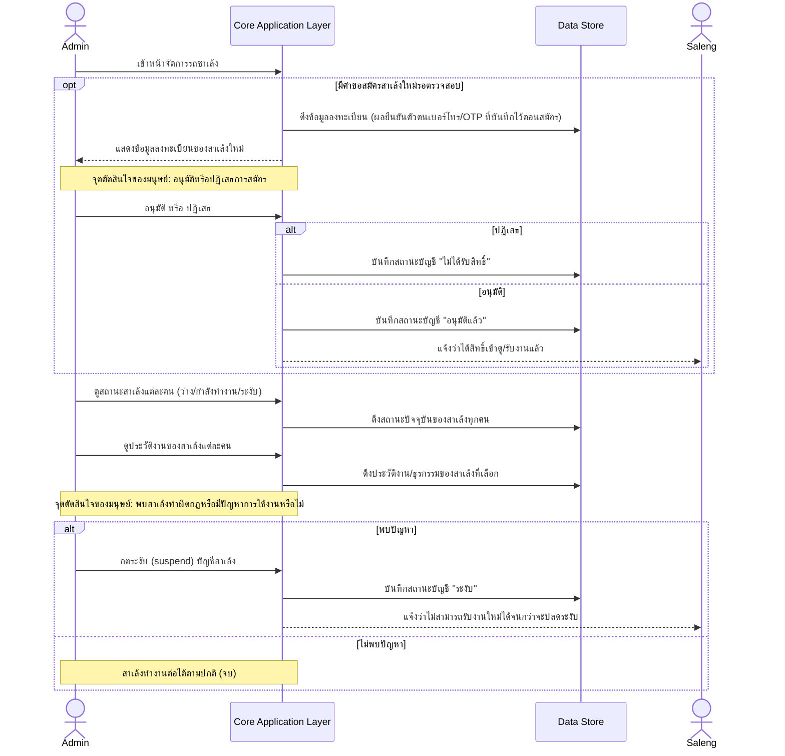
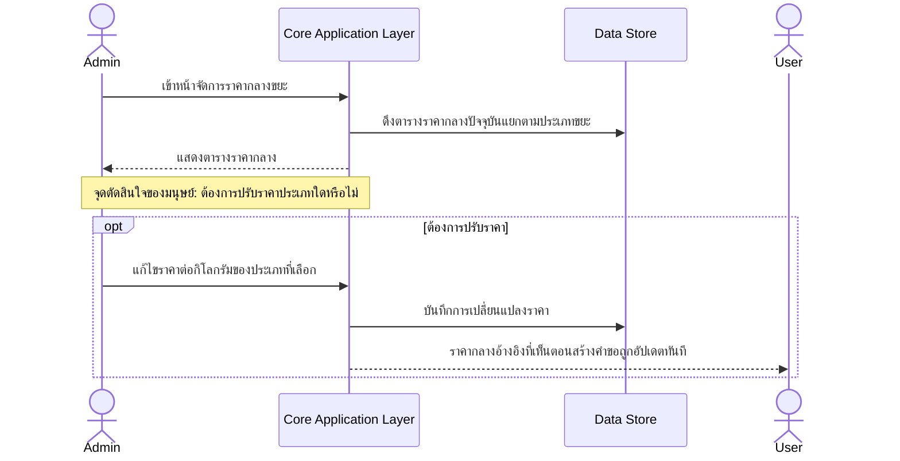

# High-Level Architecture (Conceptual)

> เอกสารนี้อธิบายโครงสร้างระบบในระดับแนวคิด (conceptual) เท่านั้น **ไม่ผูกมัดกับ technology stack ใดๆ** การเลือกภาษา/framework/database/บริการภายนอกจริงจะอยู่ในเอกสารแยกต่างหากภายใต้โฟลเดอร์เดียวกันนี้เมื่อถึงขั้นตอนออกแบบเชิงเทคนิค

## ภาพรวมและจุดประสงค์

ระบบ call-saleng เชื่อม 3 บทบาท — User (เจ้าของขยะ), Saleng (คนขับรถซาเล้ง), Admin (ผู้ดูแลระบบ) — เข้าด้วยกันผ่านวงจรชีวิตของ "คำขอเรียกรถซาเล้ง" ตั้งแต่สร้างคำขอ ตรวจสอบ/จับคู่ ไปจนถึงปิดงานและออกใบเสร็จ เอกสารนี้สรุปว่าระบบต้องมี component/layer เชิงแนวคิดอะไรบ้างเพื่อรองรับ business rule ใน [[../../01-requirements/01-spec/20260819-001-saleng-pickup-request|Call-Saleng: ระบบเรียกรถซาเล้งมารับซื้อขยะ Recycle ที่บ้าน]] และข้อมูลไหลผ่านส่วนไหนบ้างเมื่อแต่ละ persona เดินตาม journey ของตัวเอง ครอบคลุมทั้ง 5 journey ที่มีอยู่ในปัจจุบัน:

1. [[../01-prototypes/20260820-001-user-pickup-request-journey|User — สร้างและติดตามคำขอเรียกรถซาเล้ง (Pickup Request) Journey]]
2. [[../01-prototypes/20260820-002-saleng-job-fulfillment-journey|Saleng — รับงานและปิดงาน (Job Fulfillment) Journey]]
3. [[../01-prototypes/20260820-003-admin-request-matching-journey|Admin — ตรวจสอบและจับคู่คำขอ (Request Matching) Journey]]
4. [[../01-prototypes/20260820-004-admin-saleng-management-journey|Admin — จัดการรถซาเล้ง (Saleng Account Management) Journey]]
5. [[../01-prototypes/20260820-005-admin-price-management-journey|Admin — อัปเดตราคากลางขยะ (Price Management) Journey]]

## Actors & System Context

ทั้ง 3 persona เข้าถึงระบบผ่านหน้าจอของตัวเองใน **Client Experience Layer** ซึ่งแยกกันเพราะแต่ละ journey แสดงให้เห็นว่าเนื้อหา/สิทธิ์การใช้งานต่างกันชัดเจน (User สร้าง/ติดตามคำขอ, Saleng ดูงาน/ปิดงาน, Admin ตรวจสอบ/จับคู่/จัดการ) แต่ทุกหน้าจอเรียกใช้ **Core Application / Business Logic Layer** เดียวกันเป็นศูนย์กลางของ business rule ทั่วไป ส่วนเรื่องการจับคู่งานโดยเฉพาะถูกแยกออกมาเป็น **Matching/Assignment** component ต่างหากที่ Core Application Layer เรียกใช้เมื่อต้อง trigger การจับคู่หรือรับผลการจับคู่ Core Application Layer และ Matching/Assignment ต่างก็คุยกับ Data Store ได้โดยตรง ส่วน Media/File Storage, Notification & Communication Layer และ External Identity Verification ยังคงถูกเรียกผ่าน Core Application Layer เพื่อให้ business rule (เช่น การตรวจสอบพื้นที่บริการ, no auto-expire, การ confirm 2 ขั้น) ถูกบังคับใช้จากจุดเดียวไม่กระจัดกระจาย

## Conceptual Components

- **Client Experience Layer (ต่อ persona)** — ส่วนติดต่อผู้ใช้ที่ User/Saleng/Admin ใช้งานจริงผ่านเว็บเบราว์เซอร์ตาม platform ที่สเปกกำหนด (Responsive Web App) รับผิดชอบการนำเสนอข้อมูลและรับ input ตาม journey ของแต่ละ persona เท่านั้น ไม่มี business logic อยู่ในชั้นนี้
- **Core Application / Business Logic Layer** — ศูนย์กลาง business rule ทั่วไปของระบบ (ไม่รวม logic การจับคู่งานซึ่งแยกไปอยู่ที่ Matching/Assignment component) ครอบคลุม: การยืนยันตัวตน/สิทธิ์การใช้งาน (login, การอนุมัติบัญชีสาเล้ง, การระงับบัญชี), วงจรชีวิตของคำขอ (สร้าง → confirm/cancel → เสร็จสิ้น), การตรวจสอบพื้นที่บริการ, การคำนวณค่าธรรมเนียมและสถานะการ settle, และการจัดการราคากลางอ้างอิง
- **Matching/Assignment** — รับผิดชอบเฉพาะกลไกจับคู่งานทั้ง 2 ช่องทางตาม business rule ของสเปก: self-pick (สาเล้งกดรับงานเอง first-come-first-served) และ admin-assign (Admin เลือก assign ตรง) บังคับใช้กฎ "คำขอ 1 รายการผูกสาเล้งได้ 1 คน ต้องหายจากรายการทันทีที่มีคนรับ" และป้องกันการรับงานซ้ำ (race condition ตอนหลายสาเล้งพยายาม self-pick คำขอเดียวกันพร้อมกัน) แยกออกจาก Core Application Layer ตามที่ user ยืนยันแล้ว เพื่อเตรียมพร้อมรองรับ auto-matching ที่ซับซ้อนขึ้นในอนาคตโดยไม่ต้องรื้อโครงสร้าง — ดูรายละเอียดใน "สมมติฐานและข้อจำกัด"
- **Data Store (บันทึกข้อมูลเชิงโครงสร้าง)** — เก็บ record ของบัญชีผู้ใช้ทั้ง 3 บทบาท, คำขอและสถานะ/ประวัติการจับคู่ (ทั้งจาก Core Application Layer และ Matching/Assignment), ใบเสร็จ/รายการธุรกรรม, ตารางราคากลางอ้างอิง และยอดค้างชำระค่าธรรมเนียม ออกแบบให้เผื่อช่องขยายสำหรับช่องทางรายได้อื่นในอนาคต (สมาชิกรายเดือน, โฆษณา) และการวิเคราะห์ข้อมูลปริมาณขยะตาม "โอกาสในอนาคต" ของสเปก แม้ MVP จะยังไม่ใช้งานส่วนนั้นก็ตาม
- **Media/File Storage** — จัดเก็บไฟล์รูปถ่ายขยะที่ User อัปโหลดต่อคำขอ (สูงสุด 5 ภาพ) แยกออกจาก Data Store หลักเพราะเป็นข้อมูลไฟล์ไบนารีที่มีลักษณะการเข้าถึง/ขนาดต่างจาก record เชิงโครงสร้าง
- **Notification & Communication Layer** — รับผิดชอบ 2 หน้าที่: (1) ช่องทางแชทระหว่าง User กับ Admin เกี่ยวกับคำขอ (2) กลไกส่งต่อการเปลี่ยนแปลงสถานะคำขอ/งานไปยัง Client Experience Layer ของแต่ละ persona ตาม business rule ของสเปกที่ระบุชัดว่า MVP ยังไม่ทำ real-time push notification (ใช้ refresh/polling แทน) — ดูรายละเอียดการตัดสินใจใน "สมมติฐานและข้อจำกัด"
- **External Identity Verification (ช่องทางส่ง OTP)** — บริการภายนอกเชิงแนวคิดที่ Core Application Layer พึ่งพาเพื่อส่งรหัสยืนยันตัวตนไปยังเบอร์โทรของ Saleng ตอนลงทะเบียน/เข้าสู่ระบบ (ตาม business rule "ยืนยันตัวตนด้วยเบอร์โทร/OTP เท่านั้น") ระบบไม่ผูกมัดว่าจะใช้ผู้ให้บริการรายใด เอกสารนี้ระบุแค่ "หน้าที่" ที่ต้องพึ่งพาแหล่งภายนอก

## Data Flow ตาม User Journey

> หมายเหตุการอ่าน diagram: participant ที่เป็น actor (User / Saleng / Admin) หมายถึงการกระทำที่เกิดขึ้นผ่าน Client Experience Layer ของ persona นั้นเสมอ ไม่ได้แยกแสดงเป็น lifeline ต่างหากเพื่อไม่ให้ diagram ยาวเกินจำเป็น ส่วนจุดที่เป็นการตัดสินใจของมนุษย์ล้วนๆ ใช้ note/alt block กำกับแทนการสร้าง diamond node

### 1. User — สร้างและติดตามคำขอเรียกรถซาเล้ง

Journey นี้เริ่มที่ User [[../../01-requirements/feature-list#User|สมัครสมาชิก/เข้าสู่ระบบ]] และ[[../../01-requirements/feature-list#User|สร้างคำขอเรียกรถซาเล้งด้วยฟอร์มรายละเอียด]] ผ่าน Client Experience Layer ของตน ทุกการกระทำถูกส่งต่อไปยัง Core Application Layer ซึ่งเป็นผู้ตัดสินใจว่าที่อยู่อยู่ใน**พื้นที่บริการเขตอำเภอเมือง เชียงราย**หรือไม่ (business rule ของสเปก) ก่อนจะให้กรอกรายละเอียดต่อ — Core Application Layer ยังเป็นผู้ดึงราคากลางจาก Data Store มาแสดงประกอบการตัดสินใจ ([[../../01-requirements/feature-list#User|ดูราคากลางอ้างอิงต่อกิโลกรัม]]) และส่งรูปที่ User [[../../01-requirements/feature-list#User|อัปโหลด]]ไปเก็บที่ Media/File Storage แยกจาก record คำขอใน Data Store

จุดตัดสินใจสำคัญ 2 จุดในสายข้อมูลนี้ (Admin confirm/cancel ครั้งแรก และ Admin confirm การจับคู่ขั้นสุดท้าย) เป็นการตัดสินใจของมนุษย์ที่เกิดขึ้นในอีก journey หนึ่ง (ดู [[../01-prototypes/20260820-003-admin-request-matching-journey|Admin — Request Matching Journey]]) โดยการ confirm/cancel ครั้งแรกยังคงอยู่ที่ Core Application Layer แต่ตั้งแต่ขั้น self-pick/admin-assign ไปจนถึง confirm การจับคู่ขั้นสุดท้าย ผลของการตัดสินใจจะถูกส่งเข้าไปที่ **Matching/Assignment** component โดยตรง (แยกออกจาก Core Application Layer แล้วตามที่ user ยืนยัน — ดู "สมมติฐานและข้อจำกัด") ซึ่งจะแจ้งผลกลับมาที่ Core Application Layer อีกทีเพื่อส่งต่อให้ User ทำให้สถานะที่ User [[../../01-requirements/feature-list#User|ดูสถานะคำขอของตัวเอง]] อัปเดตตรงกับความจริงเสมอ — เนื่องจาก MVP ไม่มี real-time push (ตาม feature-list ที่ระบุ "Won't have (this phase)") การอัปเดตสถานะจึงเกิดจาก Client Experience Layer เป็นฝ่าย refresh/สอบถามซ้ำเข้ามาที่ Core Application Layer เป็นระยะ ส่วนช่องทาง[[../../01-requirements/feature-list#User|แชทกับ Admin]]ถูกแยกไปให้ Notification & Communication Layer จัดการโดยเฉพาะ

ปิดท้ายที่สาเล้งส่งใบเสร็จเข้าระบบ ซึ่ง Core Application Layer บันทึกลง Data Store แล้วให้ User [[../../01-requirements/feature-list#User|ดูใบเสร็จ]] เป็นหลักฐานปิด loop ของธุรกรรม

### 2. Saleng — รับงานและปิดงาน

> เส้นทาง admin-assign: Admin เลือกสาเล้งโดยตรงและ confirm ขั้นแรกกับสาเล้งก่อน ทำให้สาเล้งข้ามขั้น "ดูรายการ/self-pick" ไปเลย โดยจะเห็นงานปรากฏในรายการงานของตนหลังจากขั้นตอนนั้นเสร็จ จากนั้น flow เดินต่อที่ "แสดงรายละเอียดงาน" เหมือนเดิม (รายละเอียดฝั่ง Admin ดู journey ที่ 3)

Journey นี้เริ่มจากสาเล้ง[[../../01-requirements/feature-list#Saleng|ลงทะเบียน/เข้าสู่ระบบด้วยเบอร์โทร/OTP]] ซึ่งเป็นจุดเดียวในทั้ง 5 journey ที่ Core Application Layer ต้องพึ่งพา **External Identity Verification** เพื่อส่งรหัส OTP ไปยังเบอร์โทรจริงของสาเล้ง ตาม business rule "ยืนยันตัวตนด้วยเบอร์โทร/OTP เท่านั้น" — Core Application Layer ตรวจสอบสถานะการอนุมัติบัญชีจาก Data Store ก่อนปล่อยให้สาเล้ง[[../../01-requirements/feature-list#Saleng|ดูรายการคำขอที่เปิดอยู่ในพื้นที่ที่สนใจ]] เสมอ (ดู [[../01-prototypes/20260820-004-admin-saleng-management-journey|Admin — Saleng Account Management Journey]] สำหรับขั้นตอนอนุมัติ)

เมื่อสาเล้ง[[../../01-requirements/feature-list#Saleng|กดรับงาน (self-pick)]] คำขอนี้จะถูกส่งตรงไปที่ **Matching/Assignment** component (ไม่ผ่าน business logic ทั่วไปของ Core Application Layer) ซึ่งต้องตรวจสอบกับ Data Store ทันทีว่าคำขอนั้นยังไม่ถูกรับโดยใครมาก่อน (บังคับใช้ business rule "คำขอ 1 รายการผูกสาเล้งได้ 1 คน ต้องหายจากรายการทันทีที่มีคนรับ" และป้องกัน race condition เมื่อหลายสาเล้งพยายามกดรับงานเดียวกันพร้อมกัน) แต่การผูกนี้ยังไม่ final — ต้องรอ Admin confirm ก่อนเสมอ ซึ่งเป็นจุดตัดสินใจของมนุษย์ที่มาจากอีก journey หนึ่งเช่นเดียวกับ journey ที่ 1 โดย Matching/Assignment เป็นผู้รับผลการ confirm นั้นโดยตรงแล้วแจ้งกลับ Core Application Layer อีกทีเพื่อส่งต่อให้สาเล้ง หลัง confirm แล้วสาเล้งจึง[[../../01-requirements/feature-list#Saleng|ดูรายละเอียดงาน]]และ[[../../01-requirements/feature-list#Saleng|เห็นข้อมูลติดต่อของ User]]ได้

หลังปิดงานสำเร็จ สาเล้ง[[../../01-requirements/feature-list#Saleng|ส่งใบเสร็จเข้าระบบ]] ซึ่ง Core Application Layer ต้องกระจายผลลัพธ์เดียวกันไปทั้งฝั่ง User และ Admin (ตาม business rule ที่ระบุว่าใบเสร็จต้องปรากฏทั้งสองฝั่ง) พร้อมคำนวณค่าธรรมเนียม platform fee 20 บาทต่อคำขอจากยอดรวมใบเสร็จทันที เพื่อให้สาเล้งเห็นยอดค้าง settle ตาม 3 ช่องทางที่ business model กำหนดไว้

### 3. Admin — ตรวจสอบและจับคู่คำขอ

Journey นี้คือจุดศูนย์กลางที่ Core Application Layer ร่วมกับ **Matching/Assignment** component บังคับใช้ business rule เรื่องการจับคู่ทั้งหมด Admin เริ่มจาก[[../../01-requirements/feature-list#Admin|ดูรายการคำขอที่เข้ามาทั้งหมดพร้อมรายละเอียด]] และอาจ[[../../01-requirements/feature-list#Admin|แชทกับ user เกี่ยวกับคำขอ]]ผ่าน Notification & Communication Layer ก่อนตัดสินใจ จุดตัดสินใจแรก [[../../01-requirements/feature-list#Admin|กด confirm หรือ cancel คำขอของ user]] เป็น manual gate ที่ยังอยู่ใน Core Application Layer ควบคุมว่าคำขอใดจะเข้าสู่กระบวนการจับคู่จริง เมื่อ confirm แล้ว Core Application Layer จะส่งต่อคำขอนั้นให้ Matching/Assignment เป็นผู้ดูแลกระบวนการจับคู่ทั้งหมด

จุดตัดสินใจที่สองคือ Admin จะ[[../../01-requirements/feature-list#Admin|เลือก assign สาเล้งให้คำขอที่เปิดอยู่โดยตรง]] หรือปล่อยให้ self-pick — ทั้งสองเส้นทางถูกจัดการโดย Matching/Assignment component ที่แยกออกมาต่างหากจาก Core Application Layer แล้ว (ตามที่ user ยืนยัน เพื่อเตรียมพร้อมรองรับ auto-matching ในอนาคต ดูเหตุผลใน "สมมติฐานและข้อจำกัด") และไม่ว่าจะมาจากทางไหนก็ต้องมาบรรจบที่ [[../../01-requirements/feature-list#Admin|Confirm การจับคู่งานกับ user เป็นขั้นตอนสุดท้ายเสมอ]] ซึ่ง Admin สั่งตรงไปที่ Matching/Assignment ก่อนสถานะจะเปลี่ยนเป็น "ยืนยันแล้ว รอเข้ารับ" จากนั้น Matching/Assignment จะแจ้งผลกลับมาที่ Core Application Layer เพื่อให้ Core Application Layer แจ้งผลไปทั้ง 2 ฝั่ง (User และ Saleng) พร้อมกัน สุดท้าย Admin จะ[[../../01-requirements/feature-list#Admin|ดูใบเสร็จที่สาเล้งส่งเข้าระบบ]]ซึ่งถูกบันทึกไว้ใน Data Store เป็นประวัติธุรกรรมส่วนกลาง (ขั้นตอนหลังจากงานเริ่มอย่างเป็นทางการนี้กลับมาเป็นหน้าที่ของ Core Application Layer ตามปกติ เพราะไม่เกี่ยวกับการจับคู่แล้ว)

### 4. Admin — จัดการรถซาเล้ง

หน้าจัดการรถซาเล้งรวม 4 ฟีเจอร์ไว้ในหน้าเดียวตามสเปก โดยทั้งหมดพึ่งพา Data Store ชุดเดียวกันผ่าน Core Application Layer: Admin[[../../01-requirements/feature-list#Admin|อนุมัติการสมัครของสาเล้งใหม่]]โดยอ้างอิงผลยืนยันตัวตนเบอร์โทร/OTP ที่ External Identity Verification บันทึกไว้ตั้งแต่ตอนสาเล้งลงทะเบียน (journey ที่ 2) — ไม่ได้เรียก OTP service ซ้ำในขั้นนี้ Admin เพียงตรวจสอบผลที่บันทึกไว้แล้ว จากนั้น Admin ยัง[[../../01-requirements/feature-list#Admin|ดูสถานะสาเล้งแต่ละคน]]และ[[../../01-requirements/feature-list#Admin|ดูประวัติงานของสาเล้งแต่ละคน]]เพื่อประกอบการตัดสินใจว่าจะ[[../../01-requirements/feature-list#Admin|ระงับ (suspend) บัญชีสาเล้ง]]หรือไม่ ซึ่งเมื่อระงับแล้ว Core Application Layer ต้องบังคับใช้ผลทันทีกับทุก entry point ที่สาเล้งพยายามรับงานใหม่ (cross-cutting concern ดูหัวข้อถัดไป)

### 5. Admin — อัปเดตราคากลางขยะ

Journey นี้สั้นและเป็นการบริหารข้อมูลอ้างอิง (reference data) ล้วนๆ ไม่ผูกกับ lifecycle ของคำขอโดยตรง Admin เพียง[[../../01-requirements/feature-list#Admin|อัปเดตราคากลางขยะต่อกิโลกรัมของแต่ละประเภท]]ผ่าน Core Application Layer ซึ่งบันทึกลง Data Store จุดเดียวกับที่ journey ที่ 1 ใช้ดึงราคามาแสดงให้ User ตาม business rule ที่ระบุชัดว่าราคากลางตั้ง/อัปเดตได้โดย Admin เท่านั้น และเป็นข้อมูลอ้างอิงไม่ผูกธุรกรรมจริง (ดู [[../01-prototypes/20260820-001-user-pickup-request-journey|User — Pickup Request Journey]] จุดที่ User [[../../01-requirements/feature-list#User|ดูราคากลางอ้างอิงต่อกิโลกรัม]])

## ประเด็นข้ามระบบ (Cross-cutting Concerns)

- **ความปลอดภัยของข้อมูลส่วนบุคคล**: ชื่อ เบอร์โทร ที่อยู่ของทั้ง User และ Saleng ถูกแลกเปลี่ยนกันเพื่อนัดเจอ — ต้องมีความต้องการเรื่องการจำกัดการเข้าถึงข้อมูลนี้ให้เห็นเฉพาะคู่ที่จับคู่กันแล้ว (ตาม pattern ที่ journey ทั้งสองฝั่งแสดงให้เห็นว่า "เห็นข้อมูลติดต่อ" มาหลังขั้น confirm เสมอ ไม่ใช่ตั้งแต่ต้น)
- **การบังคับใช้สถานะบัญชี (suspended) ทุก entry point**: เมื่อบัญชี User หรือ Saleng ถูกระงับ ระบบต้องปฏิเสธการสร้างคำขอใหม่/รับงานใหม่ทันทีจากทุกจุดที่เข้าถึง Core Application Layer ไม่ใช่แค่ตอน login
- **ความสอดคล้องของสถานะเดียวที่หลาย persona มองเห็นพร้อมกัน**: สถานะคำขอ 1 รายการถูกอ่านโดยทั้ง User, Saleng ที่เกี่ยวข้อง และ Admin พร้อมกัน — Core Application Layer ต้องเป็นแหล่งความจริงเดียว (single source of truth) เพื่อไม่ให้แต่ละฝั่งเห็นสถานะไม่ตรงกัน โดยเฉพาะช่วงแข่งกันรับงานแบบ first-come-first-served
- **ความพร้อมขยายของ data model**: ตามสเปกที่ระบุว่าโมเดลธุรกิจมี 3 ช่องทางรายได้ (ค่าบริการ, โฆษณา, ค่าสมาชิก) และมีโอกาสใช้ข้อมูลปริมาณขยะเพื่อวิเคราะห์ในอนาคต Data Store จึงควรถูกออกแบบให้เผื่อเก็บข้อมูลเหล่านี้ได้ แม้ MVP จะยังไม่เปิดใช้ฟีเจอร์ที่เกี่ยวข้องจริง
- **การจำกัดพื้นที่บริการ**: การตรวจสอบพื้นที่บริการ (เขตอำเภอเมือง เชียงราย) เป็นความต้องการเชิง business rule ที่ต้องถูกบังคับใช้จุดเดียวใน Core Application Layer ก่อนอนุญาตให้สร้างคำขอ เพื่อไม่ให้ต้องแก้ไขหลายจุดเมื่อขยายพื้นที่บริการในอนาคต

## สมมติฐานและข้อจำกัด

เอกสารนี้เป็นการสร้างครั้งแรก และมีจุดที่ agent ต้องตัดสินใจเรื่องขอบเขต component โดยไม่มีช่องทางถามผู้ใช้แบบโต้ตอบได้โดยตรงในสภาพแวดล้อมนี้ (ไม่มี AskUserQuestion tool พร้อมใช้งานฝั่ง agent) จึงร่างเป็นสมมติฐานไว้ก่อนแล้วส่งให้ orchestrator ถามผู้ใช้แทนผ่าน AskUserQuestion — ผู้ใช้ตอบกลับมาแล้วเมื่อ 2026-08-25 ดังนี้:

- **Matching/Assignment แยกเป็น component ต่างหากจาก Core Application Layer (ยืนยันโดย user เมื่อ 2026-08-25)**: เดิม agent ร่างไว้ว่าให้รวมไว้ใน Core Application Layer เพราะ MVP มีกฎการจับคู่ตายตัวเพียง 2 ช่องทาง (self-pick, admin-assign) แต่ user เลือกให้แยกเป็น component ต่างหากตั้งแต่ตอนนี้ เหตุผลคือต้องการเตรียมพร้อมรองรับ auto-matching ที่ซับซ้อนขึ้นในอนาคต (เช่น จับคู่ตามระยะทาง/คะแนน) โดยไม่ต้องรื้อโครงสร้างทีหลัง — เอกสารนี้จึงปรับ Conceptual Components, System Context diagram และ sequence diagram ของ journey ที่ 1, 2, 3 ให้ message ที่เกี่ยวกับ self-pick/admin-assign/การตรวจสอบว่าคำขอถูกรับไปแล้วหรือยัง ไปที่ Matching/Assignment component โดยตรงแล้วทั้งหมด
- **Media/File Storage แยกจาก Data Store หลัก (ยืนยันโดย user เมื่อ 2026-08-25)**: ตรงกับที่ agent ร่างไว้เดิมอยู่แล้ว (เพราะไฟล์รูปภาพมีลักษณะการเข้าถึง/ขนาดต่างจาก record เชิงโครงสร้าง แม้ MVP จะจำกัดแค่ 5 ภาพต่อคำขอ) — user ยืนยันให้คงไว้ตามเดิม ไม่ต้องเปลี่ยน
- **รูปแบบการอัปเดตสถานะเป็นแบบ client-pull (polling/refresh) เป็นหลัก**: อ้างอิงตรงจาก business rule ของสเปกและ feature-list ที่ระบุชัดว่า "ระบบแจ้งเตือนสถานะคำขอแบบ real-time (push notification)" เป็น Won't have ใน MVP จึงไม่ใช่จุดที่ต้องถามซ้ำ — Notification & Communication Layer ในเอกสารนี้จึงถูกอธิบายในเชิงกลไก "ส่งต่อ" ข้อมูลแบบ conceptual เท่านั้น ยังไม่ลงรายละเอียดว่า client จะ poll ถี่แค่ไหน (เป็นรายละเอียดของเอกสารเทคนิค/สถาปัตยกรรมจริงในอนาคต)
- Diagram ทั้งหมดในเอกสารนี้สืบย้อนกลับไปหา node จริงในทั้ง 5 journey doc ได้ครบทุก node ไม่มีการเพิ่ม step ใหม่ที่ journey ไม่มี

## คำถามเปิด / จุดที่ต้องตัดสินใจเพิ่มเติม

รวมจากทั้ง journey docs และจากการออกแบบ component ในเอกสารนี้ — ยังไม่มีคำตอบและควรนำไปยืนยันกับผู้ใช้ก่อนทำเอกสารเทคนิคจริง (technology stack, database schema, API):

1. เปลี่ยน/ยกเลิกสาเล้งที่ Admin เลือก assign ไปแล้ว ก่อนถึงขั้น confirm กับ User ควรทำอย่างไร (journey ที่ 3)
2. กรณี Admin **ปฏิเสธจริง** การจับคู่ที่สาเล้งกด self-pick ไว้ (ไม่ใช่แค่ยังไม่ confirm) สิทธิ์ของสาเล้งคนนั้นควรเป็นอย่างไร (journey ที่ 2)
3. ผลกระทบต่อคำขอ/งานที่ค้างอยู่เมื่อบัญชี User หรือ Saleng ถูกระงับระหว่างทาง (journey ที่ 1, 2, 4)
4. ขั้นตอน/เงื่อนไขการปลดระงับ (unsuspend) บัญชีสาเล้ง (journey ที่ 4)
5. การเปลี่ยนราคากลางมีผลย้อนหลังกับคำขอที่สร้างไว้ก่อนหน้าหรือไม่ และควรมี audit trail การเปลี่ยนราคาหรือไม่ (journey ที่ 5)

## Reference

- [[../../01-requirements/feature-list|feature-list]]
- [[../../01-requirements/01-spec/20260819-001-saleng-pickup-request|Call-Saleng: ระบบเรียกรถซาเล้งมารับซื้อขยะ Recycle ที่บ้าน]]
- [[../01-prototypes/20260820-001-user-pickup-request-journey|User — สร้างและติดตามคำขอเรียกรถซาเล้ง (Pickup Request) Journey]]
- [[../01-prototypes/20260820-002-saleng-job-fulfillment-journey|Saleng — รับงานและปิดงาน (Job Fulfillment) Journey]]
- [[../01-prototypes/20260820-003-admin-request-matching-journey|Admin — ตรวจสอบและจับคู่คำขอ (Request Matching) Journey]]
- [[../01-prototypes/20260820-004-admin-saleng-management-journey|Admin — จัดการรถซาเล้ง (Saleng Account Management) Journey]]
- [[../01-prototypes/20260820-005-admin-price-management-journey|Admin — อัปเดตราคากลางขยะ (Price Management) Journey]]
- [[index|02-technical]]
